<!-- markdownlint-disable MD033 -->
<!-- markdownlint-disable MD024 -->
# The Ultimate React Course 2024 - React, Next.js, Redux

## Welcome

### Read before you start

**<span style='color: #a3842c'>Link:** (<https://github.com/jonasschmedtmann/ultimate-react-course>)

**<span style='color: #a3842c'>Link:** (<https://www.svgrepo.com/>)

**<span style='color: #a3842c'>Snippets:**

- `CTRL+ Shift+ P; Snippets: Configure Snippets`, choose from the list *ecr.code-snippets*
- `home/ecr/.config/Code/User/snippets/ecr.code-snippets`

**<span style='color: #a3842c'>NPM:**

- `npm outdated`
- to update an outdated version: `npm i react@latest`

**<span style='color: #a3842c'>Tailwind CSS:** To avoid warnings in your `index.css` file, you need to change the VSCode intellisense to `Tailwind CSS`

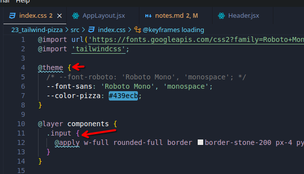

**<span style='color: #a3842c'>VSCode Basic Editing (search):** [https://code.visualstudio.com/docs/editor/codebasics]

**<span style='color: #a3842c'>HTML Entities:** [https://developer.mozilla.org/en-US/docs/Glossary/Character_reference]

**<span style='color: #a3842c'>Google Chrome override location:** DevTools / `...` / More Tools / Sensors

**<span style='color: #a3842c'>Syntax highlighting for styled-components:** vscode-styled-components

**<span style='color: #a3842c'>AI Images:** [https://www.journeyfree.ai/login]

**<span style='color: #a3842c'>CSS Grid Layout Guide:** [https://css-tricks.com/snippets/css/complete-guide-grid/]


**<span style='color: #a3842c'>CSS nth child:** [https://developer.mozilla.org/en-US/docs/Web/CSS/:nth-child]

#### Firefox not centering vertically

**<span style='color: #9e5231'>Error:** in project such as 17. WorldWise, in `CityItem.module.css`, i added this css to the class attached to my button element:

`font-family: inherit;` using a standard font, rather than the imported google font also works `font-family: inherit;`.

## A first Look at React

### React vs. Vanilla JavaScript

**<span style='color: #875c5c'>IMPORTANT:** *React* and all these other front-end frameworks are really good at keeping the data automatically in sync with the user interface.

we would really need to create a lot of extra code that, with React, we don't have to, again, because it automatically takes care of keeping the data in sync with the user interface.

### What is React?

So React is basically a huge **abstraction away from the DOM** so that we never have to work with a DOM directly as we would with vanilla JavaScript.

So we simply tell React what we want to happen when some data changes, but not how to do it. And again, we do that using **JSX**.

### Pure React

So, we have no modules here, we have no way of converting JSX, we have no HTTP server which automatically reloads the application and so on.

### React's Official Documentation

**<span style='color: #a3842c'>Link:** [https://react.dev/reference/react]

### Setting up a new React project: The Options

#### Vite: hot module replacement (hmr) and fast bundling

#### React Frameworks

In *React* documentation, you might have read that the React team now advises developers to use a so-called React framework like Next.js or Remix to build new projects.

So essentially, a React framework is a framework built on top of the React library and which is gonna make it even easier to build applications than with just vanilla React itself:

- routing
- data fetching
- server-side rendering

## Review of Essential JavaScript for React

**<span style='color: #495fcb'> Note:** to run simple *Javascript* without any HTML file:

- `node script.js`
- use **quokka**: Open the command palette in VSCode by pressing `Ctrl + Shift + P`, select *Quokka.js: Start on current file*

### Rest/Spread Operator

It can be confusing that the syntax is the same for both *rest* and *spread* operators: `...`

```javascript
const updatedBook = {
  ...book,
  // Adding a new property
  moviePublicationDate: '2001-12-19',

  // Overwriting an existing property
  pages: 1210,
};
```

**<span style='color: #875c5c'>IMPORTANT:** when spreading on an object/ array, depending where the new property is placed, here `pages` is after the spread object so it would override.

### Arrow Functions

#### IIFE using Arrow Function with parameter

**<span style='color: #a3842c'>Link:** [https://medium.com/@rabailzaheer/iife-explained-immediately-invoked-function-expressions-fccd8f53123d]

### Array filter method

If the result of the condition is true, then that element will go into the filtered array, if false it's filtered out

### Array sort method

if you use the `.sort()` directly on your array, it gets mutated.
That's why it's quite common to combine with `.slice()` method

`const sortedByPages = books.slice().sort((a, b) => a.pages - b.pages);`

### Working with Immutable Arrays

- spread operator
- JSON (parse & stringify methods)
- Lodash DeepClone

#### lodash

**<span style='color: #a3842c'>Link:** [https://lodash.com/]

`npm i --save lodash`

### Asynchronous JavaScript

**<span style='color: #a3842c'>Link:** [https://jsonplaceholder.typicode.com/]

## Working with Components, Props, and JSX

### What is JSX?

Remember that JSX is just an extension of JavaScript, which means that there is a simple way of converting JSX to JavaScript. This is done by a tool called Babel, which was automatically included in our React application.

This *Babel* conversion is necessary because browsers of course, do not understand JSX. They only understand HTML. So behind the scenes, all the *JSX* that we write is converted into many nested `React.createElement` function calls. And these function calls are what in the end, create the HTML elements that we see on the screen.

Now, what this means is that we could actually use React without JSX at all. So, we could just manually write these createElement functions instead of JSX.

**<span style='color: #875c5c'>IMPORTANT:** *JSX* is a **declarative** syntax.

So in the imperative approach, we basically tell the browser exactly how to do things. And remember that that's the reason why frameworks like React exist in the first place and it's why React chose to use a declarative approach to building user interfaces.

So, a declarative approach is to simply describe what the UI should look like at all times, always based on the current data (`props` and `states`) that's in the component.

With *declarative approach*, there are no DOM manipulation at all., so, there are no `document.querySelectors`, no `addEventListeners`, because in fact, **React is basically a huge abstraction away from the DOM, so that we, developers never have to touch the DOM directly**.

**<span style='color: #875c5c'>IMPORTANT:** Instead, we think of the UI as a reflection of the current data and let React automatically synchronize the UI with that data.

So in essence, the difference between imperative and declarative is that in the declarative approach, we use JSX to tell React what we want to see on the screen but not how to achieve it step-by-step. React can figure that out on its own, basically

### Separation of Concerns

However, as pages got more and more interactive, they became single-page applications, where the JavaScript started to determine the user interface and the content in general. Or in other words, JavaScript became more and more in charge of the HTML.

If the JavaScript is in charge of the HTML anyway, so if the logic and the UI are so tightly coupled together, then why should we keep them separated in these different files and in different code blocks? Well, the answer to that question is what gave us React components and JSX.

So the fact that logic and UI are so coupled in modern web applications, is really the reason why a React component contains the data, the logic and the appearance of one piece of the UI. In fact, it's the fundamental reason why React is all about components.

So content and logic are tightly coupled together and so it makes sense that they are co-located here. And co-located simply means that things that change together should be located as close as possible together. And in the case of React apps, that means that instead of one technology profile, we have one component profile. So one component that contains data logic and appearance, all mixed together.

At first developers hated this JSX approach. And they hated that we are throwing separations of concerns out of the window. But actually, are we really? Is there really no separation of concerns in React?

React does actually have separation of concerns. It's just not one concern per file, as we had traditionally but one concern per component.

So each component is in fact, only concerned with one piece of the UI. Then within each of these components, of course we still have the three concerns of HTML, CSS and JavaScript all mixed up, as we have been discussing.

**So compared to the traditional separation of concerns, this is a completely new paradigm that many people were really not used to in the beginning.**

**<span style='color: #495fcb'> Note:** React does actually have separation of concerns. Just a different separation of concerns.

### Passing & Receiving Props

when passing any props type different than `string`, you should use JavaScript `{}`.

#### Props are read-only

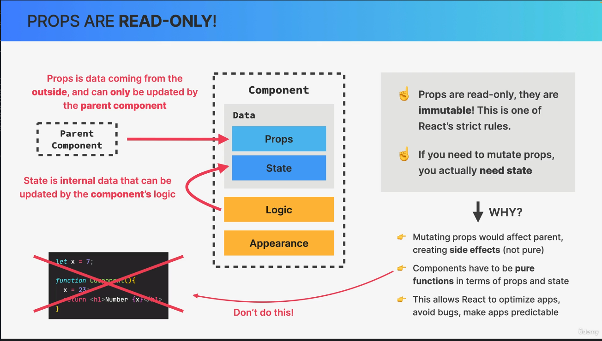

Props are a **one-way dataflow**, from top to bottom.

### Conditional Rendering with &&

*React* will not render `true/false` as a result of a JSX component, but it will render `integer` for example, so be careful when using **short-circuiting** that the test value doesn't return `0`!

**<span style='color: #875c5c'>IMPORTANT:** when returning UI JSX content with short-circuiting, always use `Boolean` and not `integer`.

### Conditional Rendering With Ternaries

**<span style='color: #a8c62c'> App.jsx**

```javascript
function Menu() {
  const pizzas = pizzaData;

  return (
    <main className='menu'>
      <h2>Our menu</h2>

      {pizzas.length > 0 ? (
        <ul className='pizzas'>
          {pizzas.map((pizza) => (
            <Pizza key={pizza.name} pizzaObject={pizza} />
          ))}
        </ul>
      ) : (
        <p>We&apos;re still working on our menu. Please come back later. </p>
      )}
    </main>
  );
}
```

you might be wondering why we cannot simply use an `if-else` statement right above. The reason is, once again, because of what we learned in the lecture on the **rules of JSX**, which is that inside this JavaScript mode, we cannot write any JavaScript. What we need to do here is to write something that actually produces a value and an if-else statement does not produce a value

### Conditional Rendering With Multiple Returns

usually this early `return`, combined with an `if` statement, is more useful when we want to render entire components conditionally but not just some pieces of JSX, as this will involve a lot of code duplication.

### Destructuring Props

**<span style='color: #495fcb'> Note:** With destructuring, in the component definition, we can immediately see that we will receive as props. That's a really big advantage of immediately destructuring props.

### React Fragment

JSX expressions must have one parent element. And so this is exactly what we learned in the Rules of JSX lecture.

So a **React Fragment** basically lets us group some elements without leaving any trace in the HTML tree, so in the DOM.

React Fragments is a very simple concept, which basically allows us to have more than just one element inside a piece of JSX.

### Section Summary

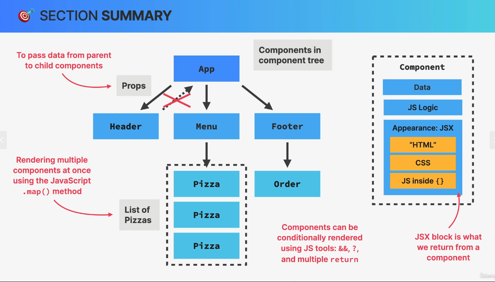

## State, Events, and Forms: Interactive components

### Handling Events the React Way

Handling events in React is actually pretty straightforward. So, as you can imagine, we are not going to use the `addEventListener` because that is the imperative way of building UIs. But here in React we use a more declarative approach. So we do not manually select DOM elements, and so therefore, we do also not use `addEventListener`.

### What is State in React?

We have learned how to pass data into a component by using props, which is data that's coming from outside the component.

- But what if a component needs to actually hold its own data, and also hold it over time?
- Also, what if we actually want to make our app interactive changing the UI as a result of an action?

Well, that's where, finally, state comes into play. So state is basically data that a component can hold over time, and we use it for information that a component needs to remember throughout its lifecycle.

**<span style='color: #495fcb'> Note:** Therefore, we can think of state as being the memory of a component.

**<span style='color: #875c5c'>IMPORTANT:** the most important aspect of state, which is the fact that updating state triggers React to re-render the component.

whenever we update a piece of state in a component, this will make React re-render that component in the user interface. So it will create a new updated view for that component. And a component's view is basically just the component visually rendered on the screen, so in the user interface.

**<span style='color: #495fcb'> Note:**

- when one single component is rendered, we call that a **view**.
- so all the views combined together then make up the final user interface.

So state is how React keeps the user interface in sync with data. We change the state, we change the UI.

**<span style='color: #875c5c'>Summary:** State allows developers to:

- update the component's view; by re-rendering it
- persists local variable between renders

### Creating a State Variable With useState

`useState` function is what we call a hook in React. And we can identify hooks because they start with this *use* keyword.

**<span style='color: #9e5231'>Error:** we can only call hooks like `useState`, **on the top level of the function**. So only here is it allowed to call use state not inside an if statement, or inside another function, or inside a loop.

**<span style='color: #495fcb'> Note:** we should really only update state using the `setter` function.

### Don't Set State Manually

When we don' use the `useState setter` function, we are directly mutating the state variable. But React is a framework which is all about immutability (and functional state update). And so, therefore, we can only update the state using the tools that React gives us, which ensure immutability.

**<span style='color: #9e5231'>Error:** Never update a state variable which is an object, by not using the `setter` function, this could mutate the object in certain (*more complex*) situation, and this is a very bad practice.

**<span style='color: #875c5c'>IMPORTANT:** So, always treat state as immutable in React. So, as something that you cannot change directly, but that you can only change using the tools that *React* gives.

### The Mechanics of State

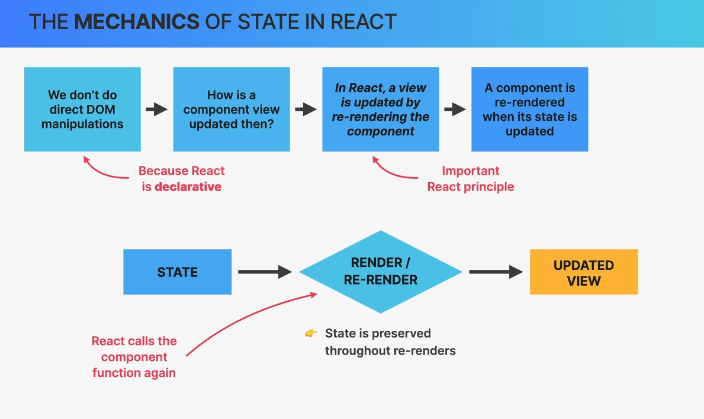

**<span style='color: #875c5c'>IMPORTANT:** This mechanic is so fundamental, that it is the reason why it's called **React**: React reacts to state changes by re-rendering the UI, and explains how React framework keeps UI in sync with data.

### React Developer Tools

you can change the value of the hooks inside the `Component` view. This can be convenient to change some state variables not accessible via the UI.

### Updating State based on Current State

**<span style='color: #9e5231'>Error:** We shouldn't update state based on the current state as we have done so far:

`if (step > 1) setStep(step - 1);`

Instead of passing a value, we should use a callback function, receiving as an argument the current value of the state.

`if (step > 1) setStep((prev) => prev - 1);`

### More Thoughts About State + State Guidelines

**<span style='color: #875c5c'>IMPORTANT:** Each component has and manages **its own state**, no matter how many times we render the same component. So, state really is isolated inside of each component.

We can basically think of the entire application view, so, the entire user interface, as a **function of state**: `UI = f(state)`.

Or, in other words, the entire UI is always a representation of all the current states in all components.

### A Vanilla JavaScript Implementation

The Vanilla JavaScript implementation is inside an HTML file where here we have first the *HTML* and then separated the *JavaScript*.

### Building a Form & handling Submissions

in a single page application, like we want to build with React, we usually can submit a form without the page reloading, by disabling the default *HTML* behavior.

### Controlled Elements

what we need to understand is that by default these input fields like this `input` and also this `select`,  they maintain their own state inside the **DOM**. So basically inside the HTML element itself.

Now this makes it hard to read their values and it also leaves this state right here in the DOM which for many reasons is not ideal.

So in React, we usually like to keep all this state in just one central place. So inside the React application and not inside the DOM, using **controlled elements**. Because that form data of course changes over time and we also want to maintain our application in sync with it.

- create `state`
- listen for the change event `onChange()`. **<span style='color: #495fcb'> Note:**, you can check the values in Dev Tools, *Components*

**<span style='color: #875c5c'>IMPORTANT:** `e.target.value` is always a **STRING**! This can be discovered using the *Dev Tools*, showing how useful they are.

```javascript
<select
  value={quantity}
  onChange={(e) => setQuantity(Number(e.target.value))}
>
```

**<span style='color: #875c5c'>IMPORTANT:** data via `props` can only flow down the tree but not up or sideways. And so this is where we really need to start thinking more about state and state management.

## Thinking in React: State Management

### Fundamentals of State Management

#### State: When and Where?

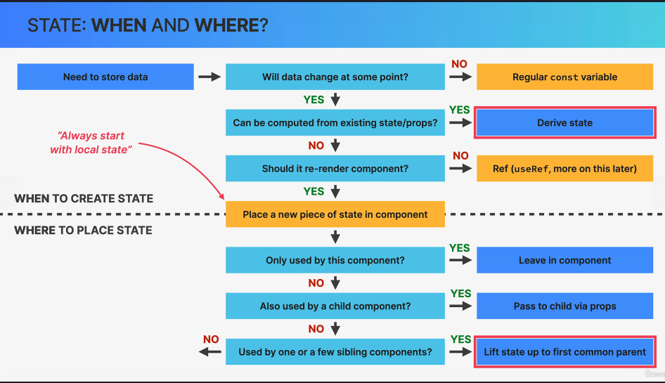

### Thinking about State and Lifting State Up

```javascript
// ERROR: below would mutate our state object/array of items
setItems((items) => items.push(item));

// CORRECT:
function handleAddItems(item) {
  setItems((items) => [...items, item]);
}
```

if we have a state, that we want to pass/share with a sibling component, we can't use `props`, *But data can only flow down the tree. It cannot flow up the tree or sideways.* We now need to **lift up the state** to the closest parent component.

**<span style='color: #495fcb'> Note:** We can pass anything as a `prop` and that includes functions.

### Reviewing Lifting Up State

#### Child-to-Parent Communication

Child updating parent state = data flowing up

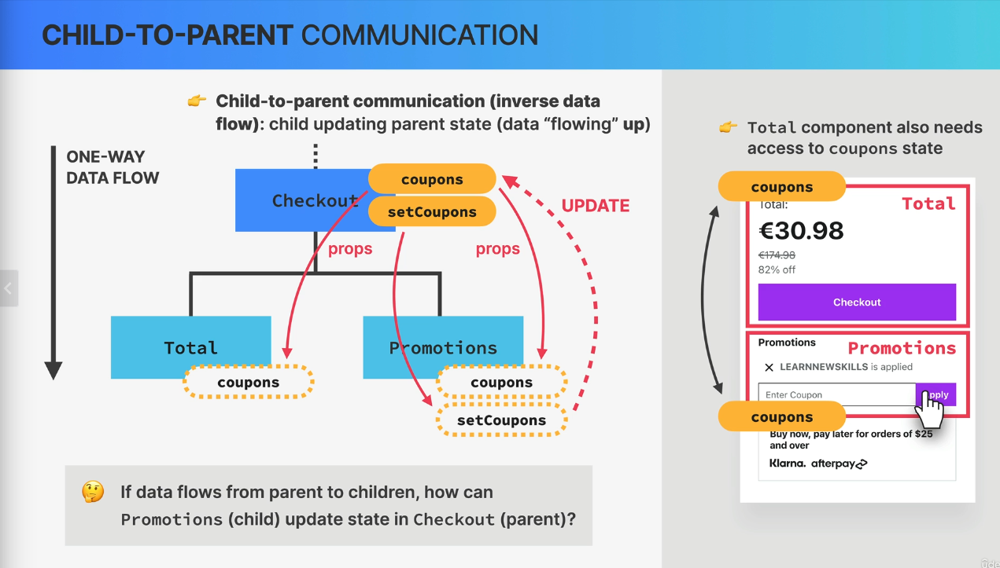

### Sorting Items

To display the items sorted by whatever criteria we selected, we will just create a new *variable* which is then sorted by that criteria. **So we are not going to manipulate the original items array**. That state should stay unchanged. We will **not** create a *new state variable* here because that's totally unnecessary.

### The Children Prop: Making a Reusable Button

What if we could pass simply some *JSX* into the component and then the component could use that *JSX* and simply display it?

the children prop is a prop that each React component automatically receives. And the value of the children prop is exactly what is between the opening and the closing tag of the component.

**<span style='color: #495fcb'> Note:** It's actually one of its most useful features. And the reason for that is that it allows us to make our components truly reusable.

## Practice Project: Eat-N-Split

### Adding a new Friend

We can create random id using the built-in browser `crypto.randomUUID()`.

**<span style='color: #495fcb'> Note:** this wouldn't work in older browsers.

### Creating Controlled Elements

**<span style='color: #9e5231'>Error:** what happens when we click on one of these other friends, and we have already set values for the controlled variables within the `FormSplitBill`?  the state has not been reset, it is exactly the same when we click on other friends. that this happens because this component is rendered in exactly the same place in the component tree as before. The same component is rendered again in exactly the same position. So the component doesn't disappear in the meantime and so therefore it is not really re-rendered. And so that means that the state then stays the same.

If we close a friend, and select a new one, then this component is re-rendered and the state is reset.

## Thinking in React: Components, Composition, and Reusability

### How to Split a UI into Components

**<span style='color: #495fcb'> Note:** Too many small components leads to too much abstraction: **creating something new to hide the implementation details of that object**.

For example, when we create a button component, the user of that component might have no idea how the button actually does what it does, because the implementation details are hidden behind this abstraction, so behind this component. *So in a way, each new component we create is an abstraction*.

4 criteria for splitting a UI into components:

- logical separation of content / layout
- reusability
- responsibilities / complexity
- person coding style (some prefer to work with smaller components)

### Component Categories

- Stateless / presentational components
- Stateful components
- Structural components (a result of components composition)

### Prop Drilling

So basically *prop drilling* means that we need to pass some prop through several nested child components in order to get that data into some deeply nested component.

All intermediary components needed this `prop` for, was to then pass it down even further the tree. And so we end up with a lot of props that are really not needed at all. All they are needed for is to pass the data down even further into our component tree.

### Component Composition

it allows re-usability of a component by using the `{children}` prop, essentially similar to an empty slot that is passed to the re-usable component.

**<span style='color: #495fcb'> Definition:** Component composition = combining different components using the **children** prop,  or **explicitly defined props**. It is used:

- create highly reusable and flexible components
- fix prop drilling (great for layouts)

**<span style='color: #875c5c'>IMPORTANT:** this is possible because components don't need to know their children in advance.

### Passing Elements as Props (Alternative to children)

that would be a perfect use case for passing a *prop* with a specific name instead of the *implicit children prop*.

**<span style='color: #495fcb'> Note:** using `{children}` is clearly the preferred way of doing this inside React.

### Building a reusable Star Rating component

Setting default `props` in *React*: `export default function StarRating({ maxRating = 5 }) {}`

### Handling Hover Events

So whenever we hover over these stars we get like a temporary rating here exactly with the number of stars that are currently being hovered.

So the rating is set to five, but again whenever we hover over some other number of stars then that temporarily changes to that rating. So what that means is that now we need a *brand new piece of state* to basically store that temporary rating. And again, that makes sense because  something should happen on the screen. **So the component should re-render whenever there is some hover event**.

### Improving Reusability with Props

So, if we imagine that we want to reuse this component in many other applications, or maybe even *publish it to NPM* to share it with all React developers around the world, then they will probably not find this component very useful right now.

we now need to define a good **public API**  for this *star* component. This is the interface of our component.

**<span style='color: #875c5c'>IMPORTANT:** Now, maybe you heard or read that *we should never initialize state from props*. However, this is only true if you want the state variable to stay in sync with that passed in props, or in other words, if you want the state value to update in case that the prop value is also updated. However, that is clearly not the case here. So, we are really only using this defaultRating here basically as seed data, so really just as the initial state, and we don't care whether this value here maybe changes somewhere else in the application, so outside this component. And, therefore, this is perfectly fine and normal to do. so it's really no problem to initialize your state based on a prop. So this was more relevant in the old days of React before we had hooks, but now, that's really no longer a problem.

### PropTypes

So with propTypes, we can basically specify the type of value that we expect the consumer of the component to pass in for each of the props.

Now, if you really care about this, you should actually just use **TypeScript** instead of JavaScript.  Developers these days don't really use `PropTypes` anymore but moved to `TypeScript`.

there's no need to install this `propTypes` package because *vite / create-React-App* already comes with this package pre-installed.

```javascript
<StarRating
  color='lightblue'
  maxRating={'test'}
  className={styles.forTest2}
  onSetRating={setMovieRating}
/>
```

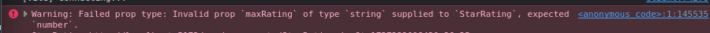

these warnings right here that will then allow other developers to catch bugs like this.

## How React Works behind the scenes

### Components, Instances and Elements

Component can be seen as the template, the blue-print, while  an instance is the actual physical manifestation of a component living in the component tree.

#### Components & Instances

**<span style='color: #495fcb'> Note:** And we also say that a UI is made up of components, not of component instances, even though instances would technically be more accurate.

#### Instances

JSX get converted to multiple `React.createElement` function calls. Then as *React* calls these functions, the result will be a React element.

So a React element is basically the result of using a component in our code. It's simply a big immutable JavaScript object that React keeps in memory.

A **React element** basically contains all the information that is necessary in order to create DOM elements for the current component instance. And so it's this React element that will eventually be converted to actual **DOM elements**, and then painted onto the screen by the browser.

So based on all this, the DOM elements are the actual, final and visual representation of the components instance in the browser. And again, it's not React elements that are rendered to the DOM. React elements just live inside the React app and have nothing to do with the DOM. They are simply converted to DOM elements when they are painted on the screen in this final step.

So this is the journey from writing a single component to using it multiple times in our code as a blueprint all the way until it's converted to a React element, and then rendered as HTML elements into the DOM.

### Instances and Elements in Practice

**<span style='color: #a8c62c'> App.jsx**

if we would `console.log(<DifferentContent/>)` inside our `.jsx` component, it will internally call the different content function and will then return this React element.

`$$typeof: Symbol(react.element)`:  a security feature that React has implemented in order to protect us against cross-site scripting attacks. So, notice how this is a symbol and symbols are one of the JavaScript primitives, which cannot be transmitted via JSON, or in other words, this means that a symbol like this cannot come from an API call.

So if some hacker would try to send us a fake React element from that API, then React would not see this type of as a symbol. Again, because symbols cannot be transmitted via JSON. And so then React would not include that fake React element into the DOM so protecting us against that kind of attack.

So, if React calls are component internally when it renders them, so just as it did here in this previous line, then maybe you have wondered, why don't we just call components directly: `DifferentContent()` instead of `<DifferentContent />`.

We would still get a `react.element` but not of type *DifferentContent` anymore, but instead of type *div*, which is the content of that component.  React does no longer see this as a component instance, and instead it just sees the raw React element, which is really not what we want. So, when we write, or actually when we use a component, we want React to see the component instance and not the raw output element like this one.

**<span style='color: #9e5231'>Error:** when we call a component directly, then React no longer sees it as a component instance, and it would not appear in the component tree. The state that this component manages is actually now inside the parent state or the parent component, same as any other hooks. So, for all these reasons, you should never ever do what we just did here because this will create multiple problems such as violating the rules of hooks

### How Rendering Works: Overview

In React, **rendering is not about updating the DOM** or displaying elements on the screen. Rendering only happens internally inside of React and so it does not produce any visual changes.

Now, in all the previous sections, I have always used the term rendering with the meaning of displaying elements on the screen because that was just easy to understand and it just made sense.

### How Rendering Works: The Render Phase

If you update the highest component in a component tree, then the entire application will actually be re-rendered. React uses this strategy because it doesn't know beforehand whether an update in a component will affect the child components or not. And so by default, React prefers to play it safe and just render everything.

Also, keep in mind once again that this does not mean that the entire DOM is updated. It's just a virtual DOM that will be recreated which is really not a big problem in small or medium sized applications.

What happens next is that this new virtual DOM that was created after the state update will get reconciled with the current so-called Fiber tree as it exists before the state update. this reconciliation is done in React's reconciler which is called Fiber.

In the fiber tree, for each React element and DOM element, there is a fiber, and this fiber holds the actual component state, props, and a queue of work.

The computation of these DOM updates is performed by a diffing algorithm, which step by step compares the elements in the new virtual DOM with the elements in the current fiber tree, so to see what has changed.

Then the results of this reconciliation process is gonna be an updated Fiber tree, so a tree that will eventually be used to write to the DOM.

And this process of comparing elements step-by-step based on their position in the tree is called **diffing**.

**<span style='color: #495fcb'> Note:** it's important to note that the render face is asynchronous so fiber can prioritize and split work into chunks and pause and resume some work later. And this is necessary for concurrent features and also to prevent the JavaScript engine to be blocked by complex render processes.

### How Rendering Works: The Commit Phase

The *render phase* results in a **list of DOM updates**, which are used in the **commit phase**.

Commit phase is when React writes to the DOM (so called, *changes are flushed to the DOM*): insertions, deletions and updates.

Commit phase cannot be interrupted and so is synchronous.

### How Rendering Works: The Commit Phase

The React Library is not the one responsible for writing to the DOM, because the DOM is just one of many hosts to which React apps can be committed, so to which they can be output, basically.

And for each of these hosts we have a different package that we can use. And that's why in our index.js file, we always import both `React` and `React DOM`.

#### Recap

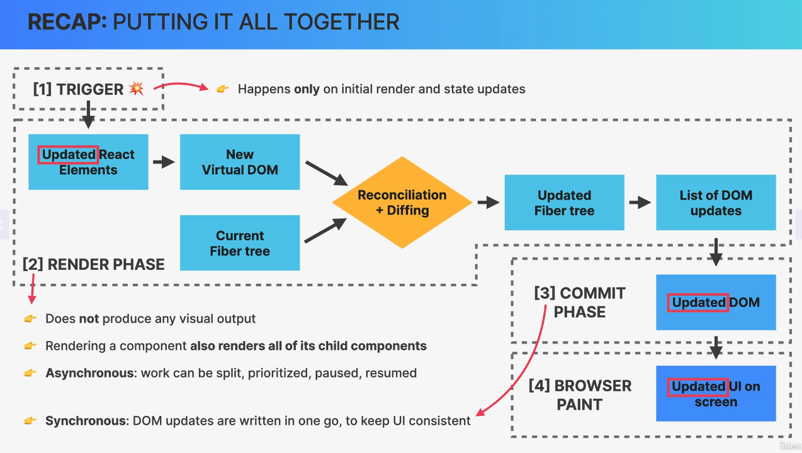

### How Diffing Works

**<span style='color: #875c5c'>IMPORTANT:** If it was not the **element type** that has changed, but simply an **attribute of an HTML element** or a **prop of a  component**, *React* is gonna simply mutate the DOM element attributes / React elements that will be passed in the new props. So React tries to be as efficient as possible and so the DOM elements themselves will stay the same. They're not removed from the DOM, and even more importantly the state will not be destroyed.

State of an element will be preserved if (not reset):

- if the element stays the same element between renders,
- and it also stays in the exact same place in the component tree.

Now sometimes we actually don't want this standard behavior but instead to create a brand new component instance with new state. And so that's where the `key prop` comes into play.

### Diffing Rules in Practice

Based on the `Diffing rule` we just learnt, in our app, if we change *tab*, the states such as *number of likes, show/hide details* are preserved, which without knowledge of the `Diffing rule` would look really strange. Because we would expect that whenever we go to a new tab, that the state would be reset. But that's not what happens.

**<span style='color: #875c5c'>IMPORTANT:** when we click on the `tab`, the `tabContent` we are in a situation where **the same component is in the same position in the tree**, and for that reason the **state is preserved across renders**.

As we keep clicking around these tabs here, this component instance here is actually not destroyed. So it stays in the DOM and the only thing that changes is the props that it receives.

However if we click on *tab4*, where the `DifferentContent` component is rendered. So it's still in the same position of the tree but it's a different content, i.e. a different component. And so now if we go back to any of the first 3 tabs, the state has actually been reset. And so that's because the `tabContent` that we had here before has been completely destroyed and removed from the DOM in the meantime, while we were at the `differentContent`.

Now sometimes of course, we do not want this behavior. , I actually expect that when I go to a new tab that it starts again with the default state, we use the `key prop`.

### Key Prop

`Key prop`:

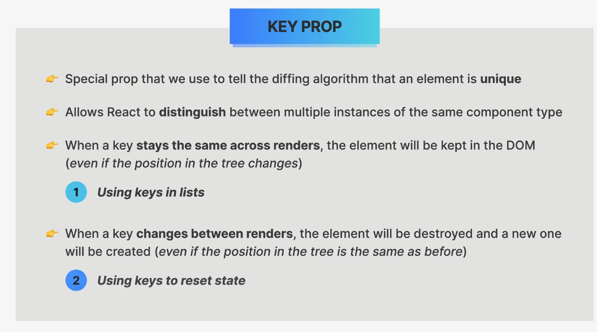

### Resetting State with Key Prop

**<span style='color: #875c5c'>IMPORTANT:** to avoid the default behavior of state being preserved under conditions (same element, same position in the tree), we can use the key prop to change this. By assigning a `key prop` to each components, So then each time that this *tabContent* component is re-rendered, it'll get a different key. And so then React will see it as a unique component instance.And therefore, then the old one will be destroyed, and the state will be reset.

React now views this as a completely different instance of `tabContent`. And we can see that because now in *dev tools / components*, this key is displayed.

### Rules for Render Logic: Pure Components

**<span style='color: #875c5c'>IMPORTANT:**
>
- **Components must be pure when it comes to render logic**: given the same props (input), a component instance should always return the same JSX (output).
- **render logic must produce no side effects**
>

### State Update Batching in practice

**<span style='color: #a8c62c'> App.jsx / TabContent**

```javascript
function handleUndo() {
  setShowDetails(true);
  setLikes(0);
  console.log(likes);
}
```

**<span style='color: #495fcb'> Note:** the `console.log()` will return the previous value of the state, as the state is in fact actually only updated after the re-rendering, or basically during the re-rendering, but not immediately after we call this function `setLikes()`.

**<span style='color: #875c5c'>IMPORTANT:** Re-Render will not even occur if the new state values are equal to the actual state values, React will not even try to attempt to update the state, and then of course, it will also not re-render the component instance.

**<span style='color: #9e5231'>Error:** the state update is asynchronous and the updated state value can't be accessed on the next line of code, it's staled! We have to use a callback function, instead of just a value, **as in the callback function, we do actually get access to the latest updated state**.

```javascript
function handleTripleInc() {
  // setLikes(likes + 1);
  // setLikes(likes + 1);
  // setLikes(likes + 1);

  setLikes((likes) => likes + 1);
  setLikes((likes) => likes + 1);
  setLikes((likes) => likes + 1);
}
```

**<span style='color: #495fcb'> Note:** let's just prove that automatic batching now works in *React 18* even outside of event handlers, , our component was only rendered once, a single 'render' string was logged.

```javascript
function handleUndoLater() {
  setTimeout(handleUndo, 2000);
}
```

### How Events Work in React

**<span style='color: #875c5c'>IMPORTANT:**

- during the **capturing** and **bubbling** phases, the event really goes through every single child and parent element one by one. In fact, it's if the event originated or happened in each of these DOM elements.
- by default, event handlers listen to events not only on the target element, but also during the bubbling phase, so if we put these two things together, it means that every single event handler in a parent element will also be executed during the bubbling phase as long as it's also listening for the same type of event.
- this concept allows for event delegation.

**<span style='color: #495fcb'> Note:** Event delegation, this is done all the time in vanilla JavaScript applications. However, in React apps, it's actually not so common for us to use this technique. however in React it can still be useful:

- because sometimes you find some strange behaviors related to events in your applications, which might actually have to do with event bubbling,
- this is actually what React does behind the scenes with our events

What *React* actually does is to register all event handler functions to the root DOM container, and that root container is simply the DOM element in which the *React* app is displayed. It's worth knowing is that React physically **registers one event handler function per event type**, and it does so at the root note of the fiber tree during the render phase.

**<span style='color: #875c5c'>IMPORTANT:**React actually performs event delegation for all events in our applications. So we can say that React delegates all events to the root DOM container, not where we registered them.

**<span style='color: #495fcb'> Note:** it's really the DOM tree that matters here, not the component tree. So just because one component is a child of another component, that doesn't mean that the same is true in the displayed DOM tree.

#### Synthetic Events

So in vanilla *JavaScript*, we simply get access to the native DOM event object, for example, *pointer event, mouse event, keyboard event, and many others*.

*React*, on the other hand, will give us something called a synthetic event, which is basically a thin wrapper around the DOM'S native event object, and by wrapper we simply mean that synthetic events are pretty similar to native event objects, but they just add or change some functionalities on top of them.

*Synthetic Events* have the same interface as native event objects and that includes the important methods: *stopPropagation*, *preventDefault*, they were added to fix some browser inconsistencies.

The React team also decided that all of the most important synthetic events actually bubble, including the focus, blur, and change events, which usually do not bubble. The only exception here is the *scroll* event, which does also not bubble in React.

### Framework vs. Library

**React**, which is what we call a *View library*, view because all React does is to draw components onto a user interface, so onto a so-called *view*.

Now, if you want to build a large scale single page application, you will need to include many external third party libraries for things like routing, styling, HTTP requests, and so on.

So all these functionalities are not part of React itself unlike what happens with Angular and other frameworks.

#### Frameworks built on top of React

Now, many React developers actually do feel overwhelmed by having to take so many decisions and choosing between so many third party libraries.

And so this fact, among some other reasons, has led to the development of multiple **opinionated React frameworks** such as:

- Nextjs
- Remix or
- Gatsby

So, Nextjs or Remix are React frameworks because they are actually built on top of React. So they basically extend React's functionality and they are opinionated because other developers basically included their own opinions into how to handle stuff like routing, state management, or styling into these frameworks.

So, where in a traditional React app, we have to make decisions about what libraries to include in an app built with a React framework. Some of these important decisions have already been taken away from you, the developer. And so this makes project development much easier and much faster, and it can also lead to a better overall developer experience, offloading much of the setup work from the developer.

In fact, we can even describe many of these frameworks as full stack React frameworks because they include so many features that we can actually build full stack apps with them,

## Effects and Data Fetching

### How NOT to Fetch Data in React

**<span style='color: #875c5c'>IMPORTANT:** We have learned before in the previous section, we should never update state in render logic.

#### OMDB API

**<span style='color: #a3842c'>Link:** [https://www.omdbapi.com/]

#### How to fix `process` is not defined (React+Vite), when using `.env` file

**<span style='color: #9e5231'>Error:** You should not use *dotenv* package with *React* (but with *Node*)

in then `.env` file, prefix your key with `VITE_OMDB='test123'`

in your `.js / .jsx` code: `console.log(import.meta.env.VITE_OMDB);`

this data fetching that we're doing is actually introducing a side effect into the component's render logic. So it is clearly an interaction with the outside world, which should never be allowed in render logic.

All this code at the top level of the function is of course code that will run as the component first mounts and therefore it is called render logic. And so again, here we should have no side effects.

**<span style='color: #a8c62c'> App.jsx**

```javascript
export default function App() {
  const [movies] = useState(tempMovieData);
  const [watched] = useState(tempWatchedData);

  fetch(`http://omdbapi.com/?apikey=${KEY}&s=interstellar`)
    .then((res) => res.json())
    .then((data) => setMovies(data['Search'])); // ERROR: Infinite loop of http requests
    // .then((data) => console.log(data));

  return (
    <>
      <NavBar>
        <Search />
        <NumResults movies={movies} />
      </NavBar>
      <Main>
        <Box>
          <MovieList movies={movies} />
        </Box>
        <Box>
          <WatchedSummary watched={watched} />
          <WatchedMoviesList watched={watched} />
        </Box>
        {/* <Box element={<MovieList movies={movies} />} /> */}
      </Main>
    </>
  );
}
```

**<span style='color: #9e5231'>Error:** So we got some data from the API now showing up in our UI, but watch what happens when we check out the `Network` tab of the `Dev Tools`.

So you see that it's basically running an infinite number of requests here, so it keeps going and it never really stops. So every second our app is firing off multiple fetch requests to this API, which of course is a really, really bad idea.

Why do you think all these fetch requests are being fired off?

- Well, the reason is that setting the state here in the render logic will then immediately cause the component to re-render itself again. So that's just how state works, right?
- However, as the component is re-rendered, the function here of course is executed again, which then will fetch again, which in turn will set the movies again as well. And then this whole thing starts over and over again.
- **<span style='color: #875c5c'>IMPORTANT:** And so this really is an infinite loop of state setting and then the component re-rendering. And so **this is the reason why it is really not allowed to set state in render logic**.

### useEffect to the Rescue

The idea of the `useEffect` hook is to give us a place where we can safely write side effects, just  like data fetching. But the side effects registered with the `useEffect` hook will only be executed after certain renders, i.e. only write after the initial render, which is exactly what we are looking for in this situation.

the first argument is the side effect you want to be run, i.e. a *JavaScript function* and the second argument is the dependencies that will cause this hook to be run again, if you pass an empty array `[]`, it will only run when the component is mounted.

**<span style='color: #495fcb'> Note:** in a larger, more real world application, we may use some external library for data fetching. But again, in a small application like this one, this is now a great way to fetch some data on mount, so when our application first loads.

#### A First Look at Effects

Event Handlers are the preferred way of creating side effects, we should use `useEffect` as little as possible.

### Using an Async Function

```javascript
useEffect(function () {
  async function fetchMovies() {
    const res = await fetch(`http://omdbapi.com/?apikey=${KEY}&${query}`);
    const data = res.json();
    
    setMovies(data['Search']);
    // console.log(movies); //ERROR: above line is asynchronous, so we will get the prev. value of movies
    console.log(data['Search']); //NOTE: OK
  }

  fetchMovies();
}, []);
```

Remember that setting the `state` is an **immutable action**.  

`setMovies(data['Search']);`:  after the state has been set in this line of code, or actually after we instructed React to set the state, that doesn't mean that this happens immediately. So instead, it will happen after this function here has been called.

### The useEffect Dependency Array

**<span style='color: #495fcb'> Note:** Every **state variable** and **props** used inside the effect **MUST** be included in the dependency array. Otherwise we get a **stale closure**.

Effects are actually only executed after the browser has painted the component instance on the screen. So, not immediately after render, as you might have thought initially. That's why we say that **effects run asynchronously** after the render has already been painted to the screen.

And, the reasons why effect work this way is that effects may contain long-running processes, such as fetching data. So, in a situation like that, if React would execute the effect before the browser paints a new screen, it would block this entire process, and users would see an old version of the component for way too long.

### Synchronizing Queries With Movie Data

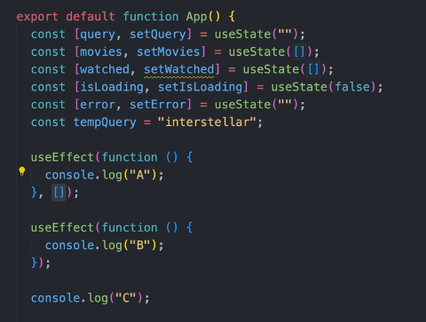

`C` will be logged first when the component mounts, as this is read during the *render* step, component logic is indeed read/processed during the render phase, while `A` & `B` will be logged after, when the browser has repainted.

**<span style='color: #495fcb'> Note:** if we type new text in the searchBar, then only `C` and `B` are logged again, but not `A`, which has an empty dependency while `B`, with no dependency defined will be executed/synchronized on each render, which is indeed triggered when `states` or `props` of a component change.

These labels would clearly describe the above logic:

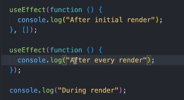

### Selecting a Movie

**<span style='color: #a3842c'>Link:** HTML entity:

```JavaScript
<button className='btn-back' onClick={onCloseMovie}>
  &larr;
</button>
```

### Adding a Watched Movie

**<span style='color: #a8c62c'> WatchedMoviesList.jsx**

```javascript
<button
    className='btn-delete'
    onClick={() => onDeleteWatched(movie.imdbID)}
>
```

Above in the `onClick` event, we need to pass a **function**, not a function call (Nb: this is anonymous function, itself calling our `onDeleteWatched` function in that instance)

**<span style='color: #875c5c'>IMPORTANT:** when moving a lot of data up and down the tree and the same for some handler functions, the `components` menu of the `Dev Tools` is a great place to look at the structure of the web app.

### Adding a New Effect: Changing Page Title

changing the page title in the browser, so outside here of the application, is a side effect because we are very clearly going to interact with the outside world, so basically with the world outside of our React application. And so again, this is then considered a side effect.

**<span style='color: #875c5c'>IMPORTANT:** So we should always use different effects for different things. So basically, that each effect has only one purpose, so it only does one thing.

**<span style='color: #495fcb'> Note:** you see that initially, the title is undefined, which is because in the beginning, this movie object is still empty, and only after the movie actually arrives from the API, the component will re-render and then we have the correct title that is then logged to the console.

So moving back to our effect, basically, what happens here is that again, in the beginning, the title is undefined. And so since this effect only runs exactly once, when the component mounts, it will just stay undefined forever.

So when the component re-renders with the correct movie object and the correct title, our effect will right now not react to that. So it will not be re-executed. Now, luckily for us, we already know how to fix that. So we just have to include this title variable here in the dependency array.

```javascript
useEffect(
    function () {
      if (!title) return;
      document.title = `Movie | ${title}`;

      //NOTE: cleanup function
      return function () {
        document.title = 'usePopcorn';
        console.log(`Clean up effect for movie ${title}`);
      };
    },
    [title]
  );
```

**<span style='color: #495fcb'> Note:** this cleanup function here will actually run after the component has already unmounted. And so if that's the case then how will the function actually remember this title here? So again, this function here runs only after the component has already disappeared from our component tree and so all the state including the `movie` object has been destroyed.

But still our function here remembers the title. So how is that? Well, it's because of a **very important concept in JavaScript called a closure**. So basically a closure in JavaScript means that a function will always remember all the variables that were present at the time and the place data function was created.

So in the case of our cleanup function here, it was created by the time this effect first was created here. And so by that time the title that was actually defined will be remembered.

**<span style='color: #495fcb'> Note:** the cleanup function runs:

- when the component unmounts
- between component re-renders

### Cleaning up Data Fetching

**<span style='color: #9e5231'>Error:**at the moment, we send one http request per keystroke.

- having so many requests at the same time will slow each of them down.
- this means that we will end up downloading way too much data.
- We always want exactly the last request of all to be the one that matters, and this is not guaranteed at the moment with potential **race condition**, which occurs if some intermediary request with broken search term takes longer, it would then be the wrong request displayed onto our UI.

We can solve that issue by using a **native browser API, which is the abort controller**, which has nothing to do with *React*.

With this *abort controller*:

- all previous request which are not the last one, got canceled
- we can also see that now we no longer have all these different requests happening at the same time.  there is basically only one request happening at a time, until it then got canceled by the next one.
- the last one that we were actually interested in, was of course *not* canceled.

So each time that there is a new keystroke, the component gets re-rendered. Between each of these re-renders, the cleanup function of our `useEffect`, will get called. So on each new keystroke, so a new re-render, our controller will abort the current fetch request. And so that is exactly what we want, to cancel the current request each time that a new one comes in.

**<span style='color: #9e5231'>Error:** as soon as a request get canceled, JavaScript actually sees that as an error. So basically when a fetch request, as it is canceled, it'll throw an error, which will then immediately go here into our catch block, where the error is set.

`ChatGPT` recommends `lodash`, relying on an external library.

### One More Effect: Listening to a Keypress

```javascript
useEffect(
  function () {
    function callback(e) {
      if (e.code === 'Escape') {
        onCloseMovie();
        // console.log('Closing');
      }
    }

    document.addEventListener('keydown', callback);

    return function () {
      document.removeEventListener('keydown', callback);
    };
  },
  [onCloseMovie]
);
```

Without the `cleanup` function, we see that if we log a *closing* message, they keep on accumulating.

The reason is that each time that this effect here is executed, it'll basically add one more event listener to the document.

And so if we open up 10 movies and then close them all, we will end up with 10 of the same event listeners attached to the document. This is why we also need to clean up our event listeners.

## Custom Hooks, Refs, and more State

### React Hooks and Their Rules

**<span style='color: #495fcb'> Note:** **Hooks rely on call order**,  his is very convenient because by using the call order, we developers don't have to manually assign names to each hook, which would create multiple problems.

### The Rules of Hooks in Practice

From `Components` in the `Dev Tools`, each of the hooks is identified by React by their order number, not some name.

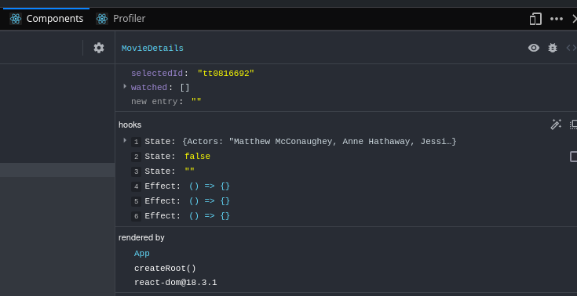

**<span style='color: #9e5231'>Error:** If you introduce an `if` statement with a hook, you'll have to disable eslint `/* eslint-disable */`, on the next render, you'll get an error message that a change of order of Hooks has been detected.

You would get the same error if you include an **early return**.

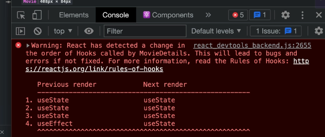

### More Details of useState

**<span style='color: #495fcb'> Note:** The power and one of the great advantages of derived state, which is that it updates basically as the component gets re-rendered.

**<span style='color: #495fcb'> Note:** we do not get access to the updated state right after we call the state updating function; this is called **asynchronous state setting**; we usually say that your state variable is **stale** at this point. So only once React is done processing this event handler it will then update all the state and re-render the UI.

The solution is to use a callback function:

```javascript
setAvgRating(Number(imdbRating));
// ERROR: setAvgRating((avgRating + userRating) / 2);
setAvgRating((avgRating) => (avgRating + userRating) / 2);
```

To persist the watch list in local storage in between refresh, we can:

- store the data into local storage each time that a new movie is actually added: `handleAddWatched`
- second option is to use `useEffect`

**<span style='color: #a8c62c'> App.jsx**

As the update of the watched state variable happens asynchronously with the `setter` method, to update our local storage we can't simply use `watched` variable but `[...watched, movie]` instead

```JavaScript
function handleAddWatched(movie) {
  setWatched((watched) => [...watched, movie]);
  
  localStorage.setItem("watched", JSON.stringify([...watched, movie]));
}
```

when using `useEffect`, we don't have to create any new array because this effect will only run after the watched state has already been updated (new state).

```javascript
useEffect(
  function () {
    localStorage.setItem('watched', JSON.stringify(watched));
  },
  [watched]
);
```

To retrieve the localstorage data when the app mounts, instead of just passing in a value to our state,we can pass in a callback function.

And so that's because the `useState` hook also accepts a callback function instead of just a single value. And so we can then initialize the state with whatever value this callback function will return.

**<span style='color: #875c5c'>IMPORTANT:** And also just like the values that we pass in, React will only consider this function here on the initial render. So this function is only executed once on the initial render and is simply ignored on subsequent re-renders.

```javascript
 // const [watched, setWatched] = useState([]);
  const [watched, setWatched] = useState(function () {
    const storedValue = localStorage.getItem('watched');
    return JSON.parse(storedValue);
  });
```

**<span style='color: #9e5231'>Error:** passing a function inside `useState` is ok, but we cannot call a function inside `useState`! `useState(localStorage.getItem('watched'))`. Even though React would ignore the value of this it would still call this function on every render, which is not good.

when we delete a movie from here, and you see that it actually automatically got removed here from the local storage as well. it's because thanks to our effect here we have effectively synchronized the watched state with our local storage. So when the watched state changes, our local storage changes as well.

**<span style='color: #495fcb'> Note:** And so this is a great advantage of having used the `useEffect` hook instead of setting local stage right in the event handler, because we would also have to manually set the local storage here as we deleted a movie.

### How NOT to Select DOM Elements in React

**<span style='color: #a8c62c'> NavBar.jsx**

```javascript
useEffect(function () {
  const el = document.querySelector(".search");
  console.log(el);
  el.focus();
}, []);
```

React is all about being declarative. And so manually selecting a dom element like this is not really the React way of doing things.

To make the action of selecting an elements more declarative, such as everything else in React, we need the concept of `useRef`.

### Refs to select DOM Elements

Below the variable and html element are connected in a declarative way, without any `querySelector`.

**<span style='color: #a8c62c'> NavBar.jsx**

```javascript
const inputEl = useRef(null);

<input
  onChange={(e) => setQuery(e.target.value)}
  ref={inputEl}
/>
```

**<span style='color: #495fcb'> Note:** we need to use an effect in order to use a ref that contains a DOM element because the ref only gets added to this DOM element, after the DOM has already loaded. And so therefore we can only access it in effect which also runs after the DOM has been loaded.

### Refs to Persist Data Between Renders

**<span style='color: #a8c62c'> MovieDetails.jsx**

```javascript
const countRef = useRef(0);

useEffect(
  function () {
    if (userRating) countRef.current++;
  },
  [userRating]
);
```

To update a ref, we use a `useEffect`, because we are not allowed to mutate the ref in render logic. So instead we need to use a `useEffect`.

**<span style='color: #495fcb'> Note:** So with a `ref`, we don't have a set function but instead we simply mutate the current property which is in the ref.

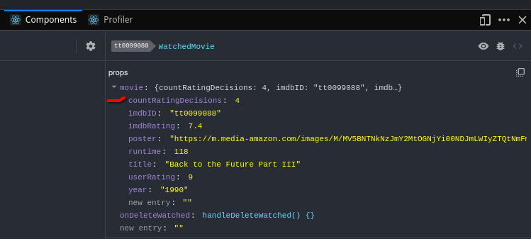

### Creating our First Custom Hook: useMovies

**<span style='color: #875c5c'>IMPORTANT:** Remember that **JavaScript hoisting** works with standard functions but not arrow functions, and is one of the reason why function declaration can be better.

**<span style='color: #9e5231'>Error:**

in our custom hook, if we update the dependency as suggested, we get an infinite reload : `[query, callback]`

from the Q&A: Lecture 170

"I tried finding the solution to this problem by googling and I came across the useCallback hook read the documentation and I think I found the solution is this correct?"

`const handleCloseMovie = useCallback(() => setSelectedID(null), []);`

`Copilot` refers this to `memoization` of a function inside of a `useEffect`

### Challenge1: useGeolocate

When we create our own custom hooks, we take all the non-visual logic, so all the logic that contains some React hooks, and which is relevant to a certain thing and so in this case, that thing is to use geolocation.

we took these three state variables and also this event handler function and then returned off that from our custom hook, and so then **we encapsulated all of those states and all the logic inside this custom hook!**

## The Advanced useReducer Hook

### Managing State with Reducer

**<span style='color: #875c5c'>IMPORTANT:** **useReducer decouples state logic from component.**

#### State with useReducer


### Loading Questions from a fake API

`npm run i json-server`

in the `package.json`, add in the `dependencies` section : `"json-server": "^1.0.0-beta.3",`

in the `Konsole`, you can get the ip address of the *localhost server*: `hostname -I`

### Handling new answers

**<span style='color: #875c5c'>IMPORTANT:** whenever possible, we should try to put as much of the logic for calculating the next state right into the reducer.

So it's better for this logic here to be in the reducer than in the place where the event is actually first handled.

### Setting Up a Timer With useEffect

We couldn't start the timer in the `App.jsx` component here because then the timer will start running as soon as the entire application mounts but that's not what we want.

So we have to place this `useEffect` into one of the components that mounts as the game starts, i.e. the `Timer.jsx` component.

#### Re-renders in large applications

when one component re-renders, all its child components will re-render as well.

So our state lives here in this global `App.jsx` component, and so therefore as our state re-renders so will re-render all of these child components.

**<span style='color: #495fcb'> Note:** And so this could become a performance issue in a really large application with like a thousand components. So in that case, you probably shouldn't have your most parent component re-rendering every single second.

### Challenge: Adding the highscore

`curl -X GET -H "Content-Type: application/json"  "<http://localhost:9000/questions>"`

## React Router: building Single-Page Applications (SPA)

### Routing and Single-Page Applications (SPAs)

#### What is Routing

most front-end frameworks have these client side routing capabilities baked right into the framework.

But React is different, because it relies on third party packages for many different functionalities, and routing is one of them.

So in React, routing is usually handled by this third party package called `react-router`. And this is probably the most important and most used React third party library out there. So if you want to learn React development, you need to learn React Router.

The reason for that is that routing is fundamental for building something that we call **single-page applications**.

#### SPAs

Single-page applications, or SPAs for short, are web applications that are executed entirely on the client, so only in the user's web browser.

single-page applications rely heavily on the concept of routes where different URLs correspond to different views.

Whenever a user clicks on a special link provided by the Router, the URL in the browser simply changes.

In the case of React, this job is usually done by `react-router`.

Now, changing the URL will then trigger the DOM to be updated as a result. And in single-page applications, it's always *JavaScript* that will update the DOM and therefore the page.

So usually on a normal webpage, when we click on a link, the browser will load a completely new page and then show us that new page.

But single-page applications are completely different. The page is simply updated by *JavaScript*, which means that **there will never be a complete page reload**. And that's the whole point of the single-page application. It's the entire app in just one page. So without any hard reloads.

This makes the web application feel just like a native desktop or a mobile application, which is really a fantastic user experience.

whenever the URL is changed, `react-router` and `React` itself will update the DOM by simply rendering the component that corresponds to the new URL. And then, of course, the whole cycle can be repeated as many times as necessary.

So each time the user keeps clicking on a Router link, that will change the URL and the component that's being displayed on the screen, all without reloading the page.

Now, it's quite common that some pages need to display some external data, but that's not a problem at all. Whenever that happens, a component can just load some additional data from a server, usually from some kind of web API. So while the single-page app itself runs entirely on the client, it can always communicate with a server in order to fetch some data that it needs, just like we have been doing before in other applications.

What we cannot do is to load a completely new page, because then it would no longer be a single-page app.

**<span style='color: #495fcb'> Note:** we could actually say that all React apps are in fact single-page applications, because all of them are never reloaded, so think of all the apps that we have built up until this point.

However, in a professional application, that's just not enough. So big and complex applications rely on your URLs and need the routing capabilities because only then, they can become real single-page applications.

### Using CSS Modules

if you would have to declare some **global** styling inside a *module.css* file, you can use this syntax:

```css
:global(.test){
    background-color: red;
}

.nav a:global(.active) {
  color: var(--color-brand--2);
}
```

**<span style='color: #495fcb'> Note:** this *global* function is usually mostly important when we are working with some classes that are provided from external sources.

the `.active` class is given to us by `react-router` and so then if we want to style that, we need to use `global`.

**<span style='color: #875c5c'>IMPORTANT:** otherwise if we just want to define some global classes, we wouldn't do it inside a module but just inside our global CSS file.

### Building the Pages

we will use images from the `public` folder.

When using the `assets` folder, you must directly import the files into our JavaScript code.

**<span style='color: #495fcb'> Note:** we do have **global classes**

**<span style='color: #a8c62c'> index.css**

```css
cta:link,
.cta:visited { }
```

#### global styling

**<span style='color: #a8c62c'> PageNav.jsx:** our `react-router-dom NavLink` component does in fact return an `HTML anchor element`.

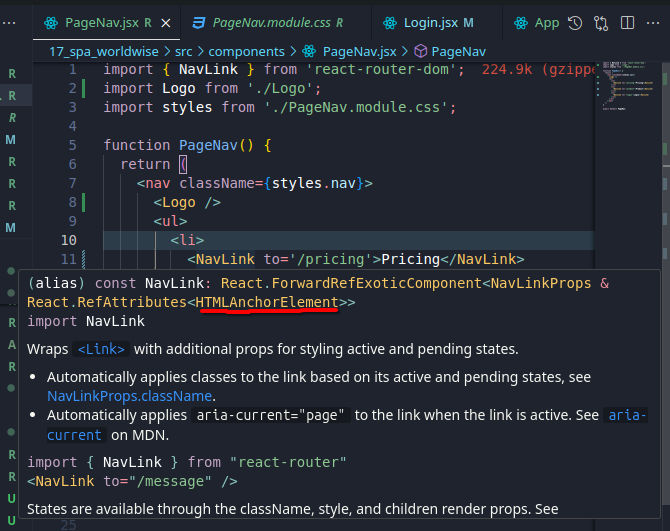

**<span style='color: #a8c62c'> PageNav.module.css:** in the dedicated *css module*, we make reference to an `anchor` element when applying styling when it is the active tab. Remember that `NavLink` automatically adds an `active` class on the `li` element active of an `ul`.

```CSS
.nav a:global(.active) {
  color: var(--color-brand--2);
}
```

**<span style='color: #875c5c'>IMPORTANT:** Below we are using the javascript way (*ctaLink*) of writing the variable instead of css (*cta-link*), as a classname with css convention would be harder to get into our `.jsx` file. It's a convention when writing `css modules` to define variable name that way.

**<span style='color: #a8c62c'> PageNav.module.css**

```css
a.ctaLink:link,
a.ctaLink:visited { }
```

### Nested Routes and Index Route

*Nested routes* help to implement a behavior  where we show a part of the *UI* based on some part of the *URL*.

A nested route influences what component is rendered inside this bigger component, for example.

you use the `<Outlet />` element inside of a component to display the component/jsx code defined of a nested route. it's similar to the `{children}`, with the difference that we are not using `elements`, but `routes`.

to show a default content in an `Outlet`, you can use an **index route**. And so an index route is basically the default child route that is going to be matched if none of these other routes here matches.

**<span style='color: #495fcb'> Note:** we can also define our root path `/` by using this `index` property in a route.

**<span style='color: #a8c62c'> App.jsx**

```javascript
{/* <Route path='/' element={<Homepage />} /> */}
<Route index element={<Homepage />} />
```

**<span style='color: #875c5c'>IMPORTANT:** It is actually very similar to something like a tabs component, we built before, but implemented in a very different way.

So before, we would've implemented that using the `useState` hook to manage the currently active tab.

But here with `react-router-dom`, we do the same thing, but in a very different way. So instead of using the `useState` hook to manage state, **we basically allow React Router and the url to store that state of the active tab**.

**<span style='color: #495fcb'> Note:** what we learnt before is not lost, as we still build components like accordions or tabbed components using the useState hook all the time. But from now on, the overall navigation of the application is in the real world always managed by something like React Router. And so that includes a small sub navigation like this one.

### Implementing the Cities List

we again use `npm i json-server`, note that that `--delay` cli option is deprecated.

**<span style='color: #a8c62c'> package.json**

```json
"scripts": {
    "server": "json-server --watch data/cities.json --port 8001"
  },
```

**<span style='color: #a3842c'>Link:** [https://www.npmjs.com/package/json-server]

Notable differences with v0.17

- id is always a string and will be generated for you if missing
- use _per_page with _page instead of *limitfor* pagination
- use Chrome's Network tab > throttling to delay requests instead of --delay CLI option

### Storing State in the Url

The URL is an easy way to store state in a global place that is easily accessible to all components in the app.

So before, if we wanted state to be accessible everywhere, we would have to store it in a parent component and then pass it all the way down to all child components using props.

But if we place state in the URL, we can easily just read the value from there, wherever the component is in the component tree. So basically we can move some state management from React to the URL.

Also, placing state in the URL is, in many situations, a good way to pass data from one page into the next page without having to store that data in some temporary place inside the app.

**<span style='color: #875c5c'>IMPORTANT:**

- `params`, which stands for parameters are very useful to pass data to the next page
- `query string` is useful to store some global state that should be accessible everywhere

### Dynamic Routes with URL Parameters

**<span style='color: #875c5c'>IMPORTANT:** Below we only append to the current url of the page we are the `id`, that's why we don't use `/`.

`<Link to={`${id}`} className={styles.cityItem}>`

### Reading and Setting a Query string

**<span style='color: #a8c62c'> components/Map.jsx**

```javascript
import { useSearchParams } from 'react-router-dom';

<button
  onClick={() => setSearchParams({ lat: '40.7128', lng: '-74.0060' })}
>
  Change Pos. Test
</button>
```

**<span style='color: #875c5c'>IMPORTANT:** Notice how actually this `state` has updated everywhere, and so that is really powerful. So it changed not only of course in the URL, but also everywhere in the application where this data is read.

we can demonstrate one of the great advantages of having all the state stored in the URL that we talked about earlier, which is that now we can just take this URL and then for example, share it with someone.

And so with this, we made the application more shareable and also *bookmarkable*.

### Programmatic Navigation with useNavigate

we use programmatic navigation, in our case when the user will click in the map container, it will activate the form component in the left component. Note that this could not be achieved with `<Link/>`.

**<span style='color: #a8c62c'> Map.jsx**

`<div className={styles.mapContainer} onClick={() => navigate('form')}>`: this is programmatic navigation where we basically in an **imperative way** navigate to this URL.

**<span style='color: #a8c62c'> AppNav.jsx**

`<NavLink to='cities'>Cities</NavLink>`: we also navigate to another page, but in a declarative way because we just declare this component in our JSX and that will then do the work.

**<span style='color: #495fcb'> Note:** We have to use the imperative way in some situations:

- after clicking event
- after submitting a form
- navigate back cannot be done with some links

**<span style='color: #a8c62c'> components/Button.jsx**

To pass dynamically to our generic `Button` component some pre-defined styles, we have to use the syntax: `styles[type]`.

```javascript
function Button({ children, onClick, type }) {
  return (
    <button onClick={onClick} className={`${styles.btn} ${styles[type]}`}>
      {children}
    </button>
  );
}

Button.propTypes = {
  type: PropTypes.oneOf(['primary', 'back', 'position']),
};
```

*<span style='color: #a8c62c'> components/Form.jsx**

as we are inside of a *HTML form*, we have first to prevent default

```javascript
<Button
  type='back'
  onClick={(e) => {
    e.preventDefault();
    navigate(-1);
  }}
>
  &larr; Back
</Button>
```

### Programmatic Navigation with <Navigate/>

since we have React hook `useNavigate`, the `<Navigate />` component is not so much used anymore, but there is still one very important use case for it, which is **inside nested routes**.

For example if we want to navigate immediately to the `<CityList />` component after clicking *Start tracking now* button of the root page.

**<span style='color: #a8c62c'> App.jsx**

```javascript
  <Route
    index
    element={<Navigate to='cities' replace/>}
    // element={<CityList cities={cities} isLoading={isLoading} />}
  />
<Route
  path='cities'
  element={<CityList cities={cities} isLoading={isLoading} />}
/>
```

**<span style='color: #495fcb'> Note:** this `<Navigate />` can be thought as a **redirect** (from index to cities here)

However the back button of our browser would not work anymore, for that it's important to add the `replace` option, which will then replace the current element in the history stack.

## Advanced State Management: the Context API

### Creating and Providing a Context

`createContext()` returns a `Component` so it's convention to start the name of that variable with a capital letter.

**<span style='color: #495fcb'> Note:** usually, we create one context per state domain.

in our case So, basically, we would have one context only for the posts and then another context only for the search data.

### Consuming the Context

the context API allows to make component more reusable and more standalone, before if you wanted to use a component that was just passing props to a child component, when reusing it you would also to replicate that prop-drilling.

You can place a component anywhere even if its parent doesn't receive the previously requested props.

### Advanced Pattern: A Custom Provider and Hook

**<span style='color: #495fcb'> Note:** Below would return an `undefined` object, because we try to use the context here inside of `App` but the context only provides the value to all its children components. So only to all of these that are below the provider.

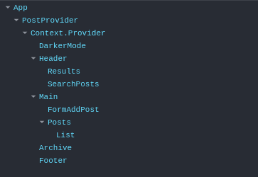

```javascript
function App(){
    const ctx = usePosts();
}
```

That's why it's a good practice to `throw new Error()` for such case:

**<span style='color: #a8c62c'> context/usePosts.jsx**

```javascript
export function usePosts() {
  const context = useContext(PostContext);
  if (context === undefined) {
    throw new Error('usePost must be used within a PostProvider');
  }
  return context;
}
```

### Thinking In React: Advanced State Management

#### State Placement Options

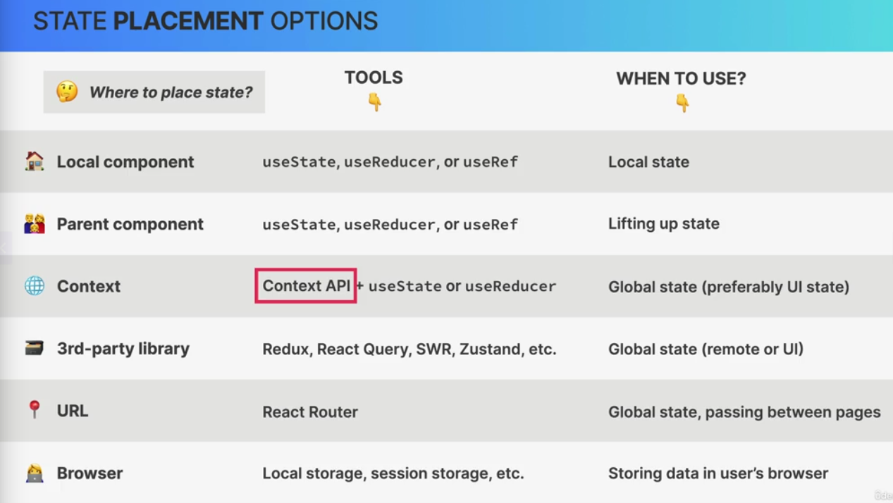

**<span style='color: #495fcb'> Note:**

- the URL is yet another excellent place where we can store global state that we want to make easily shareable and bookmarkable or that we just want to pass between pages.
- sometimes we need to store some data inside the user's browser. And in that case, we can use local storage, session storage. Now just like refs, this is state that won't actually re-render any components but it's still technically application state

#### State Management Tool Options

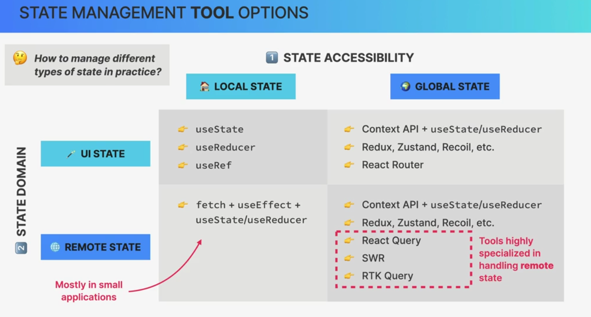

### Back to "WorldWise": Creating a CitiesContext

As you start using all these libraries then the *component tree* isn't as clean as we were used to from before.

### Finishing the City View

**<span style='color: #495fcb'> Note:** you might be wondering why we actually need to do that if we could simply get this object out of the array that we already have. And that's actually true in this small application. So technically we wouldn't have to create a new HTTP request and fetch this data from the server again because we do actually already have it in the cities array.

However, in real world web applications, it's quite common that the single objects have a lot more data than the entire collection. So basically the array returned from a *GET All* request  would only have a small amount of data in each object while then the objects that we get individually from the API have really all the data.

After we visited one of these cities when we then go back, it marks the last visited city with a green border, which means that this `CityItem` component also uses this same piece of state `currentCity` just like the `City.jsx` component.

And therefore it is a good idea to actually place the **global state** `const [currentCity, setCurrentCity] = useState({})` inside our **context**, rather than the `City` component.

**<span style='color: #a8c62c'> City.jsx**

```javascript
function City() {
  const { id } = useParams();
  const { getCity, currentCity, isLoading } = useCities();

  useEffect(() => {
    getCity(id);
  }, [id]);

  const { cityName, emoji, date, notes } = currentCity;
// ....
}
```

So when we click here on this link displayed in `CityList` component, the URL will change.

So we get a new `id` which we then read here into the `City` component. So then we have this `id` and we use it to call the `getCity` function **as the component mounts**. So immediately after mounting, we start calling this function which is coming from our **context**.

The `getCity` function, which will then immediately start fetching the city data for that `id`. Then when that arrives it gets stored here into the `setCurrentCity` state. This state variable `currentCity`, which we also paste into the context value. And so then immediately here
this `City` component receives that value as it updates, and then gets destructured and displayed in the UI.

### Including a Map With the Leaflet Library

**<span style='color: #a3842c'>Links:**

- [https://react-leaflet.js.org/]
- [https://leafletjs.com/examples/quick-start/]
- [https://react-leaflet.js.org/docs/start-installation/]
- [https://react-leaflet.js.org/docs/start-setup/]

**<span style='color: #a8c62c'> index.css**

```css
@import 'https://unpkg.com/leaflet@1.9.4/dist/leaflet.css';
```

### Displaying City Markers on Map

**<span style='color: #a8c62c'> Map.module.css**

To style the marker as we want, we use the default classnames provided by `react-leaflet` and then use our `"global(.classname)` identifier so that they can be matched and overridden.

```css
:global(.leaflet-popup .leaflet-popup-content-wrapper) {
  background-color: var(--color-dark--1);
  color: var(--color-light--2);
  border-radius: 5px;
  padding-right: 0.6rem;
}

:global(.leaflet-popup .leaflet-popup-content) {
  font-size: 1.5rem;
  display: flex;
  align-items: center;
  gap: 1rem;
}

:global(.leaflet-popup .leaflet-popup-content span:first-child) {
  font-size: 2.5rem;
  line-height: 1;
}

:global(.leaflet-popup .leaflet-popup-tip) {
  background-color: var(--color-dark--1);
}

:global(.leaflet-popup-content-wrapper) {
  border-left: 5px solid var(--color-brand--2);
}

```

### Interacting with the Map

**<span style='color: #a8c62c'> Map.jsx**

Below, `useEffect()` is used as a **synchronization mechanism**, which is one of its common use.

```javascript
 useEffect(
    function () {
      if (mapLat && mapLng) setMapPosition([mapLat, mapLng]);
    },
    [mapLat, mapLng]
  );
```

**<span style='color: #495fcb'> Note:** `e` is of course not the native event object that is created by the DOM or by React, but instead this is really coming from the **Leaflet** library (left click event).

```javascript
function DetectClick() {
  const navigate = useNavigate();

  useMapEvents({
    click: (e) => navigate(`form?lat=${e.latlng.lat}&lng=${e.latlng.lng}`),
  });
}
```

### Setting Map Position With Geolocation

To synchronize the `mapPosition` state variable:

- use another `useEffect()`, just as we did when a city of the `<CityList>` is clicked
- we could pass a setter function to our custom hook `useGeolocation.js`

**<span style='color: #495fcb'> Note:** because in React there's right now a push to write as little effects as possible, the first solution could be seen preferable.

**<span style='color: #a8c62c'> Map.jsx**

```javascript
useEffect(
  function () {
    if (geolocationPosition)
      setMapPosition([geolocationPosition.lat, geolocationPosition.lng]);
  },
  [geolocationPosition]
);
```

at the beginning, the `geolocationPosition` will by default still be null, and so then the `setMapPosition` code won't run.

But then, as we click our *USE YOUR LOCATION* button, the geolocation will get retrieved, and then of course the `geolocationPosition` state will update. And so then this effect will run, which will then in turn set the `mapPosition`, which will re-render the whole component once more, and then finally the map can move to that new position.

So basically this effect here introduces another render, which is one of the reasons why we should avoid having too many effects.

### Creating a New City

**<span style='color: #a3842c'>Link:** [https://www.npmjs.com/package/react-datepicker]

**<span style='color: #875c5c'>IMPORTANT:** using the terminology we're gonna keep the UI state in sync with remote state.

Now, this is usually not the way to go but in a small application like this one it is perfectly fine of doing this. And then the next big application we will then learn how to better do this, using `React Query`, which will make it so that whenever we add something new to the remote state that data will then automatically get re-fetched into our application.

### Context + useReducer

Inside our **reducer** function, remember that we should put as many logic as possible so that we have this central place that handles all the business logic and basically all the state transitions.

Now the problem in this case here is that **reducers need to be pure functions**, which means that we cannot do these API requests inside the reducer function. So all we can do is to still make these fetch requests in a separate function in the useEffect, and then after the data has already been received then we can dispatch actions to the reducer.

So what this means is that when asynchronous data and asynchronous code is involved, then we don't get that nice benefit where we can simply pass the dispatch function into the context value.

**<span style='color: #a8c62c'> contexts/CitiesProvider-context.jsx**

**<span style='color: #875c5c'>IMPORTANT:** Basically what we do here is to keep the remote state in sync with our UI state:

Adding the new new city to our API:

```javascript
const res = await fetch(`${BASE_URL}/cities`, {
  method: 'POST',
  body: JSON.stringify(newCity),
  headers: {
    'Content-Type': 'application/json',
  },
});
const data = await res.json();
```

And below adding it to our local state:

```javascript
dispatch({ type: 'city/created', payload: data });
```

**<span style='color: #495fcb'> Note:** The power of `useReducer` is to easily change several pieces of states on a certain event, for example when adding a new city and we want to set this added city as the new `currentCity`, you can achieve that very easily inside your reducer `type: 'city/created'`, same for the deletion event.

**<span style='color: #495fcb'> Note:** `if (Number(id) === currentCity.id) return;`:  the  `id` from `City.jsx` component is coming from from the URL. And everything coming from the URL will automatically be a string. And so if you want to do any comparisons like this then you always need to convert this to a number.

And so now if we then load two times the same city in a row then it should be instantaneous. In order to load the city it of course needs to load from the API, but if we then click the same again, it doesn't do that.

### Adding Fake Authentication: Implementing Login

**<span style='color: #9e5231'>Error:** should never have a fake user in your code which contains the plain word password, because with this, everyone who inspects your code can get access to your application.

All the code that you write inside your React application will be available on the front end, so the browsers will download it. And so, any malicious attacker will be able to find this combination of email and password in your source code. And so then, they will get access to your application.

Once we are logged in, if we try to go back (browser), it will automatically redirect us to the route `app/cities`, as we are still authenticated. to avoid such behavior, you need to pass the `replace` option (it will replace the login page in the history stack )

**<span style='color: #a8c62c'> Login.jsx**

```javascript
useEffect(
  function () {
    if (isAuthenticated) navigate('/app', { replace: true });
  },
  [isAuthenticated, navigate]
);
```

### Adding Fake Authentication: Protecting a Route

We need to wrap our application inside of our `ProtectedRoute` component. There are two places where we could do that:

- the first one is here in the `AppLayout`, and wrap the entire `return()` block, as basically our entire application is rendered there.
- in the `App` component, and wrap our `element={<AppLayout />}`

```javascript
 <Route
  path='app'
  element={
    <ProtectedRoute>
      <AppLayout />
    </ProtectedRoute>
  }
>
```

So in case that we are going to any of the URLs in the application:

- `app/cities`
- `app/cities/:id`
- `app/countries`
- `app/form`

So in all those situations, this `app` layout component here is rendered. And then in there is where each of these components are also rendered.

And so the idea is to wrap this entire component into the protected route. And so this will then check whether the user is currently logged in or not. And if not, it will simply redirect the user back here to the homepage `/`.

**<span style='color: #9e5231'>Error:** we still get an error with null property on our `user` object in `User.jsx`

Remember how our effect is actually only executed after the component has already been rendered. nd so that is actually the key to understanding why this happens. **Our component will actually initially render the children**, which does of course include the user. And so then of course everything that the user is trying to read, from the user object does not exist. So that's why we get this error.

But in that split second, we are still rendering the `User` component.

**<span style='color: #875c5c'>IMPORTANT:** And so again, that then gives us that error because again, this effect is only executed after the render has already happened.

**<span style='color: #a8c62c'> ProtectedRoute.jsx**

```javascript
function ProtectedRoute({ children }) {
  const { isAuthenticated } = useAuth();
  const navigate = useNavigate();
 
 useEffect(
    function () {
      if (!isAuthenticated) navigate('/');
    },
    [isAuthenticated, navigate]
  );

  return isAuthenticated ? children : null;
  //ERROR: return children;
}
```

### CHALLENGE #2: Refactoring "React Quiz" to Context API

In the `QuizProvider` where we pass all these different state values, **plus the dispatch function**, into the context, which is quite different to what we did earlier in the *WorldWise* application.

**<span style='color: #875c5c'>IMPORTANT:** In *WorldWise*, we didn't pass the dispatch function but really just the event handler functions. But that was because we were dealing with **asynchronous code**, which here is not the case.

And so in *ReactQuiz*, we don't need any intermediary event handler functions. We can simply dispatch this function so that we can then dispatch events in the components.

## Performance Optimization and Advanced useEffect

### The Profiler Developer Tool

So with the `Profiler`, we can basically analyze renders and re-renders. So we can see which components have rendered, see why they're rendered, and also how long each render took.

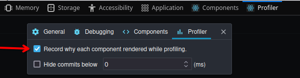

And so basically, once enabled this will give us one of the three reasons, of why each component has re-rendered:

- state update
- context update
- a parent re-rendering

We get a Flamegraph & Ranked graph, providing a representation of the component tree.

**Grey components** are actually the one that did not render while the application re-rendered. The more yellow the color the longer it took.

When hovering over we get the reason why a component did re-render.

You can access the list of different commits, or in other words, each of them here is one re-render.

### A Surprising Optimization Trick With children

**<span style='color: #a8c62c'> Test.jsx**

the idea here is that this simulates a very SlowComponent, and it takes 1/2 second until the *increase* button updates.

each time we click on the button, this `count` state updates, and so this entire component needs to get re-rendered. And so therefore this SlowComponent is also nre-rendered each time that we click the `increase` button even though this actually isn't really dependent on the state.

So the `SlowComponent` does not need the state at all but still it is being re-rendered simply because it is inside this `Test` component.

```javascript
export default function Test() {
  const [count, setCount] = useState(0);
  return (
    <div>
      <h1>Slow counter?!?</h1>
      <button onClick={() => setCount((c) => c + 1)}>Increase: {count}</button>

      <SlowComponent />
    </div>
  );
}
```

to solve this issue: we pass the `SlowComponent` as a `{children}`, and as this component exists already since the initial render, and is not affected by the state, it doesn't need to be re-rendered.

```javascript
function Counter({ children }) {
  const [count, setCount] = useState(0);
  return (
    <div>
      <h1>Slow counter?!?</h1>
      <button onClick={() => setCount((c) => c + 1)}>Increase: {count}</button>

      {children}
    </div>
  );
}

export default function Test() {
  return (
    <div>
      <Counter>
        <SlowComponent />
      </Counter>
    </div>
  );
}
```

**<span style='color: #495fcb'> Note:** You could use any `prop` name , instead of the reserved `children` prop, that would work the same way.

That's why when using the *search posts* functionality, components like `Main` and `Posts` which are passed as `children` and not affected by any states are not re-rendered (using the *Profiler*)

### Understanding memo

#### What is Memoization

if the arguments are exactly the same as before, it means that in a pure function, the output will be the same. So the result on the first call of the function can be cached, and the function won't be executed again, and the cached result can be read.

### Understanding Memo

#### the Memo function

only use `memo` when the component is heavy (slow rendering), re-renders often and with the same props.

### Memo in practice

If we set the number of archived posts to 30k, the problem is that this will slow down the entire page.

So what happens when I type something into the search bar? notice how this created a big lag, only when the archive is shown.

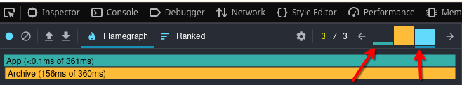

The first render is extremely fast when i enter a key in the searchBar, 1 ms, the second box is the time it took to load the archive, but the third render is when i used again the searchBar, which took more than 350ms, just the rendering itself, so painting to the DOM took even longer than this!

**<span style='color: #875c5c'>IMPORTANT:** the `Archive` is a child component of the `App` component, which is where that state actually lives. And so if we update the state in the app component, that will then trigger a re-render in all the child components and so that includes the archive. so this `Archive` component is a perfect candidate for memorization

`const Archive = memo( function Archive({ show }) {...}`

once the component is memorized, it did not render again when the state of the search bar changed, which is because the prop that it received
was still the same as before `show={true}`. And so then this component didn't have to re-render as the parent re-rendered.

**<span style='color: #9e5231'>Error:**  if we pass an **object instead of a boolean**, we are now back to basically re-rendering this component even though it is memorized and even though it looks as though our prop hasn't changed.

### useMemo in Practice

**<span style='color: #a8c62c'> App-memo.jsx**

```javascript
const archiveOptions = useMemo(() => {
  return {
    show: false,
    // title: 'Post archive in addition to main posts',
    title: `Post archive in addition to ${posts.length} main posts`,
  };
}, [posts.length]) 
```

**<span style='color: #875c5c'>IMPORTANT:** If we didn't pass `post.length` as a dependency to `useMemo`, React is still using the **stale value of this Posts state**.

we are in the presence of stale state and of a stale closure.

So a stale closure because this function was created initially and from there on, it now remembers all the variables that are referenced inside of it as they were at the time that the function was created. So that's what a closure is, and it is a stale closure because it never run again, and so it is still remembering the old values.

### useCallback in Practice

if we use our profiler, the first time we use the night color button, it's very quick but if we expand our `Archive`, so we are back again to having our memorized component re-render even though it is memorized.

**<span style='color: #9e5231'>Error:** And so now, we have the same problem but with a function `<Archive archiveOptions={archiveOptions} onAddPost={handleAddPost} />`. the solution is to memoize the function.

```javascript
const handleAddPost = useCallback(
  (post) => setPosts((posts) => [post, ...posts]),
  []
);
```

**<span style='color: #495fcb'> Note:** Using one of these functions here, like useCallback, actually has a cost as well. React needs to run this function and needs to store the function in memory. And so, that only makes sense if we actually see some improvement here in our application.

React team is currently researching a compiler that would basically automatically memorize all the values that need memorization behind the scenes.

**<span style='color: #875c5c'>IMPORTANT:** React guarantees that the **setter functions** of the `useState` hook always have a stable identity, which means that they will not change on renders. **We can basically think of these state setter functions as being automatically memorized**.

And in fact, this is also the reason why it's completely okay to omit them from the dependency array of all these hooks, `useEffect, useCallback, useMemo`.

### Optimizing Context Re-Renders

You can either:

- pass the components as `{children}` to the `Context.Provider`
- memoize the components

And this `PostProvider` is a child element of the app component. And so therefore, when the app component re-renders then this post provider re-renders, as well and therefore, this context-provider object will be recreated. And so, if this object will be recreated it means that the context value has changed and therefore, all the components that consume that context are going to be re-rendered.

that's why if we use `setIsFakeDark`, the state of the `App` component change, hence the context gets recreated and components like `List` are re-rendered. **To avoid such behavior we can memoize with `useCallback` the value of our `PostContext.Provider`.**

#### avoiding re-render due to context changes

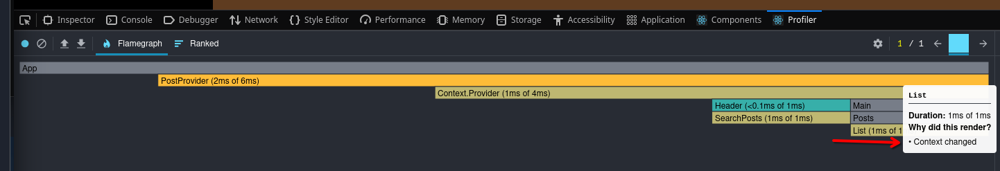

**<span style='color: #a8c62c'> PostProvider.jsx**

```javascript
const value = useMemo(() => {
    return {
      posts: searchedPosts,
      onClearPosts: handleClearPosts,
      onAddPost: handleAddPost,
      searchQuery,
      setSearchQuery,
    };
  }, [searchQuery, searchedPosts]);

  return (
    <PostContext.Provider value={value}>{children}</PostContext.Provider>)
```

**<span style='color: #875c5c'>IMPORTANT:** as soon as you change one of these states for example, the `Post` or the `searchQuery` then all of the components that read at least one of these five values will get re-rendered.

And so, again, this is not ideal and it's the reason why in the beginning I told you that we usually create one context per state.

So we would have one `Post` context and one `searchQuery` context.

And so, in that situation, whenever we updated for example, the search Query, then all the components that consume the posts would not get re-rendered. While in this case, all of them are because it is enough for one value here to change to re-render the entire thing.

### Back to The "WorldWise" App

using the `profiler dev tools`, in order to identify some really bad performing components, it's best to come to the ranked tab.

**<span style='color: #a8c62c'> City.jsx / getCity**

So here we see that issue where *eslint* is telling us to add the *getCity* to the dependencies, but remember that this created an infinite loop of HTTP requests to our API. And indeed, immediately we get like a thousand requests (devTools / network / number of requests & from the profiler very numbers of renders in a few seconds confirm too)

**<span style='color: #495fcb'> Explanation:**

- now that we have this `getCity` function in our dependency array, the `useEffect` effect will rerun each time that it `getCity` function gets updated, or in other words, that it gets recreated.
- Now, when does this function get recreated? Well, since it lives in the context, it is created in this `CitiesProvider`
- But the problem is that this `getCity` function will update the state each time that it is executed, which will then end up in an infinite loop. When we call the `getCity` function, that function will then update the state in the `CitiesProvider` component, which will then re-render, which will then recreate the `getCity` function. And as the function gets recreated, since it is here in the dependency array, then `getCity` will get called again, which then again will update a state, which will re-render, which will cause the effect to run over.
- And the way to solve the issue is to use the `useCallback` hook

### Optimizing Bundle Size With Code Splitting

We've talked a lot about optimizing wasted renders and overall app performance.

However, probably the most important thing that we can and should optimize is the **bundle size**.

So whenever some user navigates to our application, they're basically visiting a website that is hosted on some server. Now, once the user actually navigates to the app, the server will send back a huge JavaScript file to the client that is requesting it. And this file is the bundle.

**So the bundle is simply a JavaScript file that contains the entire code of the application.** And it is called a bundle because a **tool like Vite or Webpack has bundled all our development files** into one huge bundle which contains all the application code.

This means that once the code has been downloaded, the entire React application is loaded at once, which essentially turns it into a single-page application that is running entirely on the client. So whenever the URL changes in the app, the client just renders a new React component but without loading any new files from the server because all the JavaScript code is already there in the bundle.

**<span style='color: #875c5c'>IMPORTANT:** **code splitting** basically takes the bundle and, as the name says, splits it into multiple parts. So instead of just having one huge JavaScript file, we will have multiple smaller files which can then be downloaded over time as they become necessary for the application. **And this process of loading code sequentially is called lazy loading**.

this `lazy loading` feature has nothing to do with *React Router*. So any component can be lazy loaded.

`const Homepage = lazy(() => import('./pages/Homepage'));`

#### Suspense

Suspense is a **concurrent feature** that is part of modern React, and that allows certain components to suspend, which basically means that it allows them to wait for something to happen.

in our case, basically these lazy components are gonna be suspended while they're loading. And so we can then use the built-in `Suspense` component to show a fallback, which is gonna be that loading indicator

#### Bundle without lazy loading

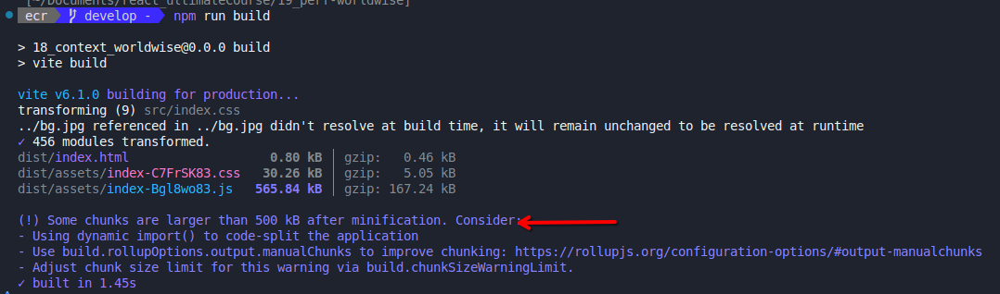

#### Bundle WITH lazy loading

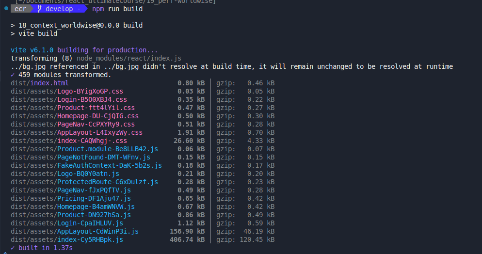

### Summary

really nice feature powered by:

- the bundler, so Vite or Webpack
- and the lazy function provided by React
- plus the import function provided by JavaScript
- and then also this Suspense component

#### Bug to import from Public folder

**<span style='color: #9e5231'>Error:** you have to prefix with `/`

```javascript
const FAKE_USER = {
  name: 'Eric',
  // avatar: 'https://i.pravatar.cc/100?u=zz',
  avatar: '/ecr.svg',
};
```

#### Bug with Suspense fallback - breaking change

From reading [Bug] [https://github.com/remix-run/react-router/issues/10568]: Suspense around router not render fallback since v6.12.0 (breaking-change) · Issue #10568 · remix-run/react-router, it looks like this was an intended change by the developers.  Following some guidance in the discussion, I was able to get something to work.  It requires adding a top-level route that directs to a component which wraps an Outlet with the Suspense.  In addition, this component uses the useLocation() hook to provide a key to the Suspense so that a new instance is created.

### CHALLENGE #1: Fix Performance Issues in "Workout Timer"

once we have memoized our 2 components, `ToggleSounds` doesn't re-render anymore as its props are either primitives, and a state setter function for which React guarantees such functions won't change between renders.

for `Calculator`, one of the prop is an array, essentially a JavaScript object, which then gets recreated on each render. we need to use `useMemo()` hook and pass the reactive value `partOfDay` used inside the array as a dependency.

also the function `formatTime` that is inside the component `App` doesn't actually use any reactive value. And so there's no need to recreate this function on every render. So we can move outside of the component.

### Setting State Based on Other State Updates

We shouldn't use the `useEffect` hook to keep state variables in sync with all these other state variables. However this can be accepted when many state variables are involved, and would be impractical to use all state setters functions inside of an event.

#### Problem with using useEffect to update states

when changing any of our inputs, state variables (sets, speed, break), this trigger a render, but which then also trigger the useEffect hook, which only runs after the render has already happened, and so as we set the state inside of useEffect, we get a second render.

This is something to keep in mind when using useEffect for that reason,But when you have so many state variables that influence the value of another state, then you can do this.

### Using Helper Functions In Effects

So each time that we click here on this button, it will set the duration and it will play the sound. Now updating the state will of course re-render the component, which will recreate this function here. So React will see a brand new function. And since this function is part of the dependency array of this effect, it will then run this effect as well. Also our timer doesn't update anymore.

- So the best strategy is always to move a function like this out of the component. However, that doesn't work because this function is of course a reactive value that depends on the prop `allowSound` and so we cannot move it outside.
- Then the other strategy would be to take the function and move it into the useEffect. But then the problem with that would be that we could no longer use it in our `handleInc/dec` functions
- And so then what we have to do is to memorize the function. And so then the function will not be recreated between these renders, using `useCallback`

**<span style='color: #9e5231'>Error:** this combination of `useCallback` and `useEffect` has now introduced 2 bugs, the sound is played and our time is changed when click on the sound toggler. the reason is that when click on the sound icon, , the `allowSound` state changes, and the function `playSound` gets recreated, and since this function is in the dependency array, it will run the effect again.

**<span style='color: #875c5c'>IMPORTANT:** The solution is to create a new separate effect which will be responsible for playing the sound.

### Closures in Effects

a stale closure / an outdated closure occurs when the function has captured the values from the closure of the function, but has changed since then.

## Redux and Modern Redux Toolkit (with Thunks)

### Creating a Reducer: Bank Account

`default:` case:

- with *useReducer*, `throw new Error()`
- with *Redux*, `return state;`

**<span style='color: #495fcb'> Note:** if you want to run the reducer, you can simply `import './stores/bank-store';` in the `App` component.

### Creating a Redux Store

After creating the `reducer` function, we now install `Redux`, `npm i redux`

**<span style='color: #495fcb'> Note:** `createStore` has now been deprecated, and the new modern way of writing Redux is `Redux Toolkit`.

### Working With Action Creators

**Action creators are nothing more than simply functions, that return actions**. So they are really not a Redux thing, and Redux would work perfectly fine without them, but they are a useful convention that Redux developers use.

One of the reason/advantage to use action creators is that it's a lot more reusable than always writing the object here by hand.

### Adding more state: Customer

**<span style='color: #495fcb'> Note:** `createdAt: new Date().toISOString()` would create a side-effect within the reducer, so even though most logic should be in the reducer, in that case it must stay within the action creator.

```javascript
function createCustomer(fullName, nationalID) {
  return {
    type: 'customer/createCustomer',
    payload: { fullName, nationalID, createdAt: new Date().toISOString() },
  };
}
```

### Back to React! Connecting our Redux App With React

`npm i react-redux`, we then need to import from that package the Provider.

we can wrap our entire application in that `Provider`, just like we do with the React `Context` API.

### The Legacy Way of Connecting Components to Redux

**<span style='color: #a8c62c'> BalanceDisplay.jsx**

`export default connect(mapStateToProps)(BalanceDisplay);` connect() will create a new function to which `BalanceDisplay` will passed as an argument , and this will return a component.

Below function maps the props and that's the name that we will destructure into our `BalanceDisplay` function/component

```javascript
function mapStateToProps(state) {
  return { balance: state.account.balance };
}
```

### Redux Middleware and Thunks

a Redux store doesn't know anything about performing asynchronous logic like this. It only knows how to synchronously dispatch actions and update the state. Therefore, any asynchronous operations like that API call need to happen outside a reducer.

we could also fetch the data inside the component and then dispatch an action to the store with that received data? it's not an ideal solution and the reason for that is that we usually want to keep our components clean and free of data fetching and we also want our important data fetching logic encapsulated somewhere, so all in one place and not have it spread all over the application. **Therefore, fetching data inside components, like we have been doing all this time, is not ideal.**

#### Redux Middleware

in Redux, Middleware is basically a function that sits between the dispatching and the store. This means that a Middleware allows developers to run some code after dispatching an action, but before that action reaches the reducer in the store.

usually after we dispatch, the action immediately reaches the reducer and the state is updated. But with a Middleware, we can do something with the action before that action actually gets into the reducer. **therefore, this is the perfect place for our asynchronous API call, as well as other operations.**

**<span style='color: #875c5c'>IMPORTANT:** Middleware is the go-to place for side effects in the Redux cycle.

we can write Middleware functions ourselves, but usually, we just use some third party package. And in the case of asynchronous operations, the most popular Middleware in Redux is called **Redux Thunk**.

data fetching is performed in the middleware, and as soon as the data arrives, we place it into the actions payload and then we finally dispatch the action into the store.

### Making an API Call With Redux Thunks

`npm i redux-thunk`

**<span style='color: #a8c62c'> features/accounts/accountSlice.js**

```javascript
export function deposit(amount, currency) {
  if (currency === 'USD') return { type: 'account/deposit', payload: amount };

  return async function (dispatch, getState) {
    dispatch({ type: 'account/convertingCurrency' });

    const res = await fetch(
      `https://api.frankfurter.app/latest?amount=${amount}&from=${currency}&to=USD`
    );
    const data = await res.json();
    const converted = data.rates.USD;

    dispatch({ type: 'account/deposit', payload: converted });
  };
}
```

if the currency is <> USD, we will dispatch a function. And so when Redux sees that, it will know that that function is the thunk. And so it will then execute that function and not immediately dispatch the action to the store.

### The Redux DevTools

`npm i @redux-devtools/extension`

**<span style='color: #9e5231'>Error:** Deprecated: `npm i redux-devtools-extension`

From the [redux-toolkit](https://redux-toolkit.js.org/api/configureStore) documentation:

```javascript
/**
   * Whether to enable Redux DevTools integration. Defaults to `true`.
   *
   * Additional configuration can be done by passing Redux DevTools options
*/
devTools?: boolean | DevToolsOptions
```

**<span style='color: #a8c62c'> stores/bank-store.js**

```javascript
const store = configureStore({
  reducer: rootReducer,
  middleware: (getDefaultMiddleware) => getDefaultMiddleware().concat(thunk),
  // eslint-disable-next-line no-undef
  devTools: process.env.NODE_ENV !== 'production',
});
```

FireFox / Chrome DevTools  - new tab `Redux`

**<span style='color: #495fcb'> Note:** You can dispatch your own actions from the console.

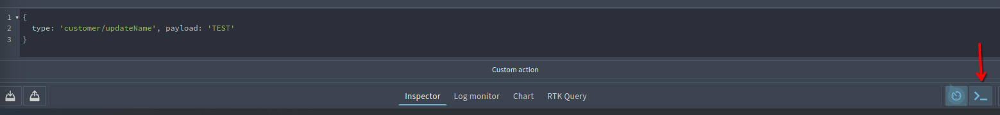

### What is Redux Toolkit (RTK)?

Redux Toolkit allows us to write a lot less code to achieve the exact same result as before. So we say that we need a lot less boilerplate code, which is basically code that only sets things up but doesn't really do anything meaningful. And so Redux Toolkit hides all that stuff.

### Creating the Store With RTK

`npm i @redux/toolkit`

### Creating the Account Slice

**<span style='color: #495fcb'> Note:** Automatically created action creators with `redux-toolkit` only accept one single argument. And so this is basically one of the limitations of having this opinionated structure. **what we have to do is to prepare the data before it reaches the reducer.**

### Back to Thunks

**Thunks** actually automatically work out of the box. And so that's because Thunks are automatically provided in Redux Toolkit, so we don't have to install anything, and this will simply already work. So no setup required.

## React Router with Data loading

### A new way of implementing Routes

in our previous app *WorldWise* we used `BrowserRouter`, `Routes` and `Route` components with which routes were declared in a more declarative way.

With `createBrowserRouter` it is done in a more imperative way. So we're declaring the router outside of the JSX and using this JavaScript array right here.

**<span style='color: #875c5c'>IMPORTANT:** This is necessary in React Router 6.4 (or later) to use this new syntax in order to enable data ew powerful APIs like data loaders, data actions, or data features of *react-router*.

### Building the App Layout

we created this `appLayout` component which we will want to use as the parent route of every single other route that we have in our application.

we made all the other routes child routes of the `appLayout`. So they are all nested routes. And then inside the parent route, we can use the `Outlet` component to render whatever is the current nested route.

**<span style='color: #495fcb'> Note:** when a route doesn't have a path, it is technically called in *React Router* a layout route.

### Fetching Data With React Router "Loaders": Pizza Menu

When using then `loader:` property, `react-router` will actually start fetching the data at the same time as it starts rendering the correct route.

**<span style='color: #495fcb'> Note:** What we did when using `useEffect`, was always a **fetch on render approach**. We rendered the component first, and then after the component was already rendered is when we then would start to fetch the data, a so-called **data loading waterfall**.

React Router is no longer only responsible for matching component to URLs in the browser but to also provide the data that is necessary for each page.

### Handling Errors With Error Elements

it's important to notice that errors (including API requests) will bubble up to the parent route unless it is actually handled in the route itself, which is done by placing error element right on the route where the error might happen.

### Fetching Orders

`useParams` is a hook and only works inside components, not within regular *JavaScript* function, however *react-router* provides the `{params}` prop.

### Writing data with react-router actions

**<span style='color: #a8c62c'> features/order/CreateOrder.jsx**

So while the loaders that we used earlier are to read data, actions are used to write data or to mutate data.

To make this form work nicely with `react-router`, we need to replace this with a `<Form />` component that `react-router` gives us.

We could also specify the action where we could then write the path that this form should be submitted to `<Form method='POST' action='/order/new'>` but this is not going to be necessary, because by default, `react-router` will simply match the closest route.

**<span style='color: #495fcb'> Note:** in your `createBrowserRouter` function, once you have added the `action` option, whenever there will be a new form submission on the route/path `/order/new`, then action `createOrderAction` that we specified here will be called.

```javascript
{
  path: '/order/new',
  element: <CreateOrder />,
  action: createOrderAction,
},
```

This entire `<Form />` works completely without any JavaScript, without any state variables and without any onSubmit handlers. So all we have is this `<Form />` component, and then *react-router* takes care of the rest.

we didn't even have to create a loading state. So React Router will do all of this automatically without us having to do anything. And the idea behind all this is to basically allow us to go back to the basics, so to the way HTML used to work back in the day before everyone started using JavaScript for the front end. So back then, we simply created HTML forms similar to this one, and then when we submitted them, a request was sent to the server.

We only need to connect the action to a specific URL.

We can use an *hidden <Input>* to get data into the action.

Once the new order data return by our API response on the `POST createOrder` endpoint, is actually returned, we can immediately redirect the page to the `/order/:id`, showing the user all the information about that new order.

**<span style='color: #9e5231'>Error:** we cannot use the navigate function comes from the `useNavigate` hook, as we cannot call hooks inside this function. So hooks can only be called inside components. And so here we need to use another function, which is called `redirect`, another function that is provided by *react-router*,which basically will just create a new response or a new request.

What matters is that behind the scenes, all of this really works with the web API's standard request and response API's.

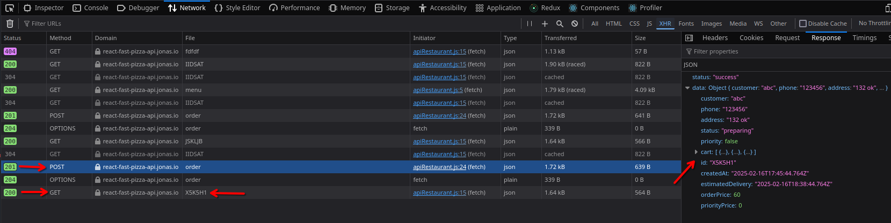

`orderAction.js`: `return redirect(`/order/${newOrder.id}`);`

a `Post` request returning the new `id` in the response can then be used to redirect `GET` request to the `/order/:id` route/path.

### Error Handling in Form Actions

in the component that is connected to this action, we can get access to whatever was returned from that action in case there was no submission.

`orderAction.js`: `const formErrors = useActionData();`

## Tailwind CSS Crash Course: Styling the App

### Setting Up Tailwind CSS

**<span style='color: #a3842c'>Link:** [https://tailwindcss.com/docs/installation/using-vite]

VSCode Extension: Tailwind CSS IntelliSense

Prettier  Plugin for Tailwind CSS (dev-dependency `-D`), that will always organize your classes in the same order in your *html, jsx* files: `npm install -D prettier prettier-plugin-tailwindcss`

**<span style='color: #a3842c'>Prettier JSX Single Quote:** [https://prettier.io/docs/options#jsx-quotes]

### Styling Text

You can apply Tailwind CSS styling to your `.jsx` files but also to the HTML elements of root html files such as `index.html`

you can apply arbitrary values to most classes when the pre-defined class are not what you need: `<Link to='/' className='tracking-[2rem]'>`

### Responsive Design

All default classes; without any prefix, are the **mobile-first classes**. So they apply only if there is no breakpoint overriding them.

for example `<div className='my-10 text-center sm:my-16'>`, the `sm:my-16` means that margin top & bottom gets applied from the `sm` value on; which is *640px* for that breakpoint.

**<span style='color: #495fcb'> Note:** You can customize your own breakpoints which aligns with CSS rule that they should match the values when your application breaks rather than pre-fixed values.

### Using Flexbox

`<div className='hidden text-sm font-semibold md:block'>Eric</div>;` will hide by default or show the user name once a certain screen size breakpoint (`md`) is reached.

### Using CSS Grid

Implementing CSS Grid will allow to easily push the overview all the way to the bottom of the screen.

### Reusing Styles With @apply

**<span style='color: #495fcb'> Note:** we should not start using `@apply` technique all over the place for all our elements because then we would simply go back to writing *CSS* in the old school way. So this should really be treated as an exception here when there are so many classes that we are using all at the same time.

**<span style='color: #875c5c'>IMPORTANT:** the actual better solution would be to reuse all of this by creating a React component.

### Configuring Tailwind: Custom Font Family

**<span style='color: #a3842c'>Tailwind Default theme variable reference:** [https://tailwindcss.com/docs/theme]

If we want to use the Google font in specific space we update the `index.css` file and in our components reuse the created font name `<header className='font-roboto'>`

**<span style='color: #a8c62c'> index.css**

```css
@theme {
  --font-roboto: 'Roboto Mono', 'monospace';
}
```

To apply it as a default font to all our components, you need to use the `--font-sans` option:

```css
@theme {
  --font-sans: 'Roboto Mono', 'monospace';
}
```

To extend Tailwind color palette:

```css
@theme {
  --color-pizza: #439ECB
}
```

## Adding Redux and Advanced React Router

### Modeling the "User" State With Redux Toolkit

Let's just use Redux in order to store that global state. Of course we could also just create a state variable right here, so inside `App.jsx` and then I guess we could somehow pass that into the components.

### Reading and Updating the User State

it is a very bad practice to connect an input field right to the Redux store.

So as we change the username here, so as we type a new input, we should really update a local state variable and not always update the Redux store.

**<span style='color: #a8c62c'> CreateOrder.jsx**

`defaultValue` allows us to set a default value at the beginning but which we can then still change, while `value` would be static.

**<span style='color: #495fcb'> Note:** this is not a controlled element but it's simply a normal HTML element which happens to have a default value, that you can still change.

```javascript
<input
  type='text'
  name='customer'
  defaultValue={username}
  required
  className='input grow'
/>
```

### Modeling the "Cart" State

**<span style='color: #875c5c'>IMPORTANT:** remember that with *Redux* we can actually mutate the state directly.

with *traditional state management*, we would do: `function handleAddItems(item) {  setItems((items) => [...items, item]);}`

### Building the Cart Overview With Redux Selectors

Redux actually recommends that we do data manipulation right inside the selector function and not out in a component.

```javascript
function CartOverview() {
  const totalCartQuantity = useSelector((state) =>
    state.cart.cart.reduce((sum, item) => (sum += item.quantity), 0),
  );
// ...
}
```

**<span style='color: #495fcb'> Note:** *Redux* recommends to place such functions right into the **slice**.

**<span style='color: #495fcb'> Note:** To improve performance of the selectors (inside slices), you can use the `redux reselect` library: [https://github.com/reduxjs/reselect]

### Using the Cart for New Orders

For dispatching, we need to call the `useDispatch` hook, which is only available in components and not in a regular function like this one.

So the hack to use if you need to dispatch within a **regular function .js like Redux actions**, and which we should really, really not overuse is to directly import the store object and then dispatch directly on that store.

**<span style='color: #a8c62c'> features/order/orderAction.js**

```javascript
export async function action({ request }) {
// ...

  // Do NOT overuse
  store.dispatch(clearCart());

  return redirect(`/order/${newOrder.id}`);
}
```

### Redux Thunks With createAsyncThunk

**<span style='color: #a8c62c'> userSlice.jsx**

`async function fetchAddress() {}` is an *async* function which means that we cannot just call this function directly inside a *Redux reducer* because remember Redux is by nature completely synchronous, and so that's why we now need to use `Thunks`.

**<span style='color: #875c5c'>IMPORTANT:** a Thunk is a middleware that sits between the dispatching and the reducer itself.

**<span style='color: #495fcb'> Note:** we name our async thunk function `export const fetchAddress = createAsyncThunk(){}` and not something like `getAddress` which are reserved for selectors.

in this example, we used the Redux Toolkit way of creating a Thunk function with `createAsyncThunk`. We passed in:

- the action type name `'user/fetchAddress'`, which we will never manually use, but still Redux needs this internally, as a first argument
- and as a second argument, we pass in the actual Thunk function, the code that we want to execute as soon as this action here will be dispatched

`createAsyncThunk` will basically produce three additional action types:

- one for the ending promise state
- one for the fulfilled state
- and one for the rejected state

And so now we need to handle these cases separately back in our reducers.

it's done using the `extraReducers` option, where you define your case, like `fulfilled`, and then pass your reducer `(state, action) => {...}`

```javascript
.addCase(fetchAddress.fulfilled, (state, action) => {
  state.position = action.payload.position;
  state.address = action.payload.address;
  state.status = 'idle';
})
```

**<span style='color: #a8c62c'> user/fetchAddress/pending**

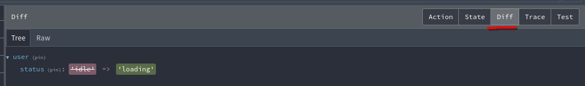

**<span style='color: #a8c62c'> user/fetchAddress/fulfilled**

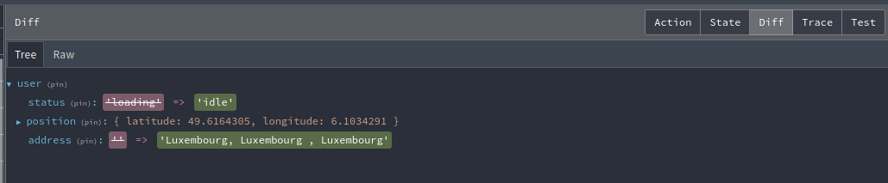

### Integrating Geolocation

when nesting our *get position* button inside of the form, it would automatically submit the form with the `onClick` event, we need to prevent that default behavior.

### Fetching Data Without Navigation: useFetcher

`useFetcher` allows you to fetch data without going to the page where the data is actually coming from, in this example `loader()` from `menuLoader.js` is called within `Order.jsx`.

### Updating Data Without Navigation

Redux will connect our `updateOrderAction` to the child component of `Order`, which is `UpdateOrder.jsx`.

```javascript
{
  path: '/order/:orderId',
  element: <Order />,
  loader: orderLoader,
  errorElement: <Error />,
  action: updateOrderAction,
},
```

## Setting up our biggest project + Styled Components

### Introduction to Styled Components

```javascript
function App() {
  const H1 = styled.h1`
    font-size: 2rem;
    font-weight: 600;
  `;

  return <H1>Hello</H1>;
}
```

this CSS is of course only scoped to this exact component `App.jsx`, which eliminates all the problems of global CSS that we talked about earlier such as name collisions between class names, or for example another developer changing the class without some other developer knowing about that which would create all sorts of problems.

```javascript
const Button = styled.button`
    font-size: 1.4rem;
    padding: 1.2rem 1.6rem;
    border: none;
    border-radius: 0.4rem;
    background-color: var(--color-primary);
    color: var(--color-white);
  `;

  return (
    <>
      <Button onClick={() => console.log('clicked')}>Check in</Button>
    </>
  );
```

So without us having to do any additional work, where before if we were to create our own button component then we would have to manually accept the `onClick` prop and then pass it to the regular HTML element, but with *styled Components*, we don't need to do that.

### Global Styles With Styled Components

`GlobalStyles` component doesn't accept any children. So it's a self-closing component, and it needs to be, then, a sibling of all the other components.

**<span style='color: #495fcb'> Note:** You can also created `Themes` with styled components.

**<span style='color: #a3842c'>Link:** [https://styled-components.com/docs/advanced]

### Styled Component Props and the "css" Function

As Styled Components are written using template literals, you can leverage a lot of JavaScript tools such as ternaries for example

to apply specific logic outside of a component, you can import `css` from styled components:

```javascript
const test = css`
  text-align: center;
  ${10 > 5 && "background-color: yellow"}
`;

const Heading = styled.h1`${test}`;
```

**<span style='color: #875c5c'>IMPORTANT:** we can pass a special prop to our components to tell them as which HTML element they should be rendered, and that special prop is called the `as` prop.

Any prop can be used, but if you want your markup to be semantically correct you have to use the `as` prop.

### Building More Reusable Styled Components

**<span style='color: #a8c62c'> ui/Row.jsx**

With React, we can define default props this below which is useful with styled components where we can use the usual `function Foo({prop = 'test'}){}`:

**<span style='color: #9e5231'>Error:**  `defaultProps` is deprecated and `attrs` should be used instead.

### Building the Sidebar and Main Navigation

To be able to style a third-party library component such as `NavLink` of `react-router-dom`, we use the following syntax provided by `styled-components`:

```javascript
const StyledNavLink = styled(NavLink)`...`
```

**<span style='color: #a3842c'>Third Party Library for React Icons:** [https://react-icons.github.io/react-icons/]

## Supabase Crash Course: Building a Back-end

### Creating a new database

**<span style='color: #a3842c'>Link:** [https://supabase.com/dashboard/project/yljpcegklwdkugjneisu]

### Adding Security Policies (RLS)

in the left Sidebar `API Docs`: Supabase automatically creates an entire API documentation for all of our tables

You can choose your tables and get a Javascript snippet or bash `curl` command to read all rows for example, **after changing the API key to Anon/public**, instead of hidden.

**<span style='color: #495fcb'> Note:** You would get an empty array because of RLS, *Role Level Security*.

#### RLS policies

So if it wasn't for the role level security or RLS policies then whoever had this key here could really, for example, delete our database or edit whatever they wanted. So of course, we don't want that to happen. We only want certain operations to be allowed, and so that's what we can set these RLS policies for.

You set them under `Authentication/Policies`

**<span style='color: #495fcb'> Note:** And by the way, if you're wondering why we didn't create that users table for authentication, it's because we will do that separately. So the Supabase authentication feature doesn't require us to manually create a table, but instead, Supabase will do that automatically.

### Connecting Supabase With Our React App

```bash
npm i @supabase/supabase-js  
```

**<span style='color: #875c5c'>IMPORTANT:** You might be wondering that if we are exposing our supabase key on the client, that then some malicious user might be able to hack our database. And the answer Would actually be true if we didn't activate row level security. But since we did anyone who has this key can only do whatever we allowed in the row level security policies.

So even though we said earlier that we were not going to do side effects inside pages, let's just do this as an experiment and use our `apiCabins` inside of `Cabins.jsx`

### Setting Up Storage Buckets

`Storage` menu in the left sidebar.

## React Query: Managing Remote State

### What is React Query?

we need a library with all these features because remote state is fundamentally different from UI state. It's asynchronous and usually shared by many users of the app, which makes it so that applications running in different browsers can very easily get out of sync with the remote data that is stored on a server.

remote state has many special needs, and so that's the reason why we use something like *React Query*.

### Setting-up React Query

**<span style='color: #a3842c'>Tanstack/react-query documentation:** [https://tanstack.com/query/latest]

`npm i @tanstack/react-query`

`staleTime` is basically the amount of time that the data in the cache will stay fresh so that it will stay valid until it is refetched again.

**<span style='color: #495fcb'> Note:** So just like `Redux`, `React Query` also has some excellent Dev Tools.

### Make sure to use React Query v4

If you want to use React Query **v5**, there are only two small things to change in the project:

- `isLoading` is now called `isPending`
- The `cacheTime` option is now called `gcTime`

### Fetching Cabin Data

**<span style='color: #a8c62c'> features/cabins/CabinTable.jsx**

Below will actually function as a table, but we don't implement it using the table HTML elements, but instead using `Table / divs` and `TableHeader / header`.

But by specifying the role, we then make sure that the browser knows that this actually should be a table and a row.

```javascript
<Table role='table'>
  <TableHeader role='row'>
```

**<span style='color: #495fcb'> Note:** we also use in our `utils/helpers` file a third-party library: `npm i data-fns`

**<span style='color: #875c5c'>IMPORTANT:** if we changed a data table, say `discount` to 200, if the data is still `fresh`, it will not immediately re-fetch the page. if on the opposite, the data is marked as `stale`, if we come back to the tab, it will automatically re-fetch/refresh the data.

And the time that it takes until the data becomes old, so until it becomes stale, is exactly that stale time that we defined in `const queryClient = new QueryClient({..})`.

### Mutations: Deleting a Cabin

**<span style='color: #495fcb'> Note:** once we've added `deleteCabin` to our `apiCabins.js` file, we also need to update our `RLS` in `Supabase`

**<span style='color: #875c5c'>IMPORTANT:** Make sure to pass a SQL condition that enables to all; such as `true`


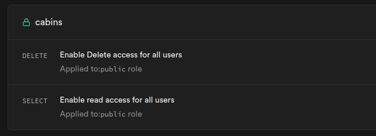

to simulate an error , we update in `supabase.js` the `supabaseUrl` and indeed we get the exact error message defined inside our `apiCabins` file.


**<span style='color: #a8c62c'> features/cabins/CabinRow.jsx**

```javascript
  const { mutate, isLoading: isDeleting } = useMutation({
    mutationFn: async (id) => deleteCabin(id),
    onSuccess: () => {
      queryClient.invalidateQueries('cabins');
    },
    onError: (err) => console.error(err.message),
  });
```

`npm i react-hot-toast`

**<span style='color: #a3842c'>React Hot Toast:** <https://react-hot-toast.com/>

### Introducing Another Library: React Hook Form

When using `npm i react-hook-form`, you don't have state variable attached to any of the input elements; i.e. *controlled elements*,  because now we will handle everything about this form using this library.

**<span style='color: #495fcb'> Note:** once we've added `<Input type="text" id="name" {...register("name")} />` to our `input` elements within `CreateCabinForm`, new props such as `onChange` are automatically added.


### Creating a New Cabin

`data: cabins` state within `CabinTable` behind the scenes is going to be just *React state* in the end.

And so whenever some new data is fetched by React Query, whenever that state updates, then the component will re-render.

### Abstracting React Query Into Custom Hooks

Abstracting  all the React query logic that we have written so far into a few custom hooks which is the best practice in a large application

**<span style='color: #495fcb'> Note:** We placed our `useDeleteCabin` custom hook inside the `features/cabin` folder, as the `hook` folder is really only for hooks that are reusable across multiple features, but this one here really is related to the cabin's feature only.

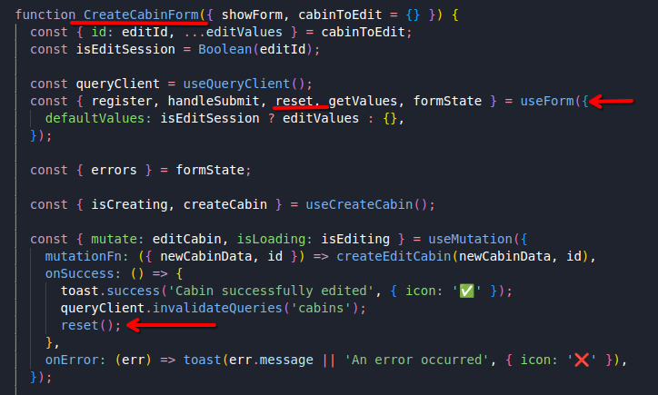

We can call the `reset()` method of the `useForm` hook provided by `react-form` inside a  `.jxs` component, but not in a `.js` custom hook. To tackle this situation well thought by `react-query`.

the `onSuccess` handler function; the result of `useMutation()` hook can be placed:

- not only right inside the `useMutation()` itself, now living within the `useCreateCabin` custom hook
- but also right in the function where the mutation actually happens `onSubmit()` function of `CreateCabinForm.jsx` component

so all we need to do is to pass in an object of options and so then there we can do `onSuccess` and then here we can very simply call the `reset` function.

**<span style='color: #a8c62c'> features/cabins/CreateCabinForm.jsx**

```javascript
if (isEditSession)
  editCabin({ newCabinData: { ...data, image }, id: editId });
else
  createCabin(
    { ...data, image: image },
    {
      onSuccess: (data) => {
        console.log(data);
        reset();
      },
    }
  );
```

Creating our custom hook makes very re-usable if we need data or mutation somewhere else in our application. we just need to copy `const { cabins, isLoading } = useCabins();` to get the cabins data as an example.

A common example is to load data on the `homepage` and then our data will get into the cache and so then whenever we come to the a page next that uses the same data, they will already be cached. so that's one of the huge, maybe even the biggest advantage of *react-query*.

## Advanced React Patterns

### The Render Props pattern

**<span style='color: #a8c62c'> App.jsx**

```javascript
export default function App() {
  return (
    <div>
      <h1>Render Props Demo</h1>

      <div className='col-2'>
        <List
          title='Products'
          items={products}
          render={(product) => (
            <ProductItem key={product.productName} product={product} />
          )}
        />
      </div>
    </div>
  );
}
```

```javascript
function List({ title, items, render }) {
// ...
    <ul className='list'>
      
      {/* {displayItems.map((product) => (
        <ProductItem key={product.productName} product={product} />
      ))} */}
      {displayItems.map(render)}
    </ul>
}
```

**<span style='color: #875c5c'>IMPORTANT:** we basically inverted the control of how it should render. So this is what we call **inversion of control** and it's an important principle in software development.

This `<List>` now no longer knows actually what it is rendering. It has no idea what will happen here inside this map function for each of the display items. All that it knows is that it received a function `render`, and that it will call that function for each items in the array. That's it.

And so now that this component doesn't know anymore what it is actually rendering, and it doesn't even care about what it is rendering, well, it then makes that very easy to reuse the component for other render props.

**<span style='color: #495fcb'> Note:** the `render` prop used to be really the main way of sharing (indistinct) logic across multiple components. So that was before we had React hooks, but now that we do have them, the render props is not that used anymore except for situations like this one. **Custom hooks are now usually the way to go when we want to share logic.**

### A Look at Higher-Order Components (HOC)

Higher Order Component is simply a component that takes in another component and then returns a new component that is better, so an enhanced version of the initial component.

### The Compound Component Pattern

We use `useContext/createContext` to implement the compound component pattern.

we need to place the children `Label, Increase, Decrease` on the counter component. And this is possible because this is simply a function. in JavaScript, we can add properties almost to everything. And so that includes functions.

### Building a Modal Window Using a React Portal

**<span style='color: #495fcb'> Note:** Pages have to be as simple as possible. So we don't want them to have any state or any effects.

If we would re-use our `createCabinForm` component in some place where it isn't contained in a modal, then it's not going to receive the `onCloseModal`, so we need to call this function conditionally, as it might not exist. To do that, **we create a callback, in the `onClick` event and call that function with the optional chaining operator.**

`<Button variation='secondary' type='reset' onClick={() => onCloseModal?.()}>`

So a React portal is a feature that essentially allows us to render an element outside of the parent component's DOM structure while still keeping the element in the original position of the component tree. So in other words, with a portal we can basically render a component in any place that we want inside the DOM tree but still leave the component at the same place in the React component tree.

And so then things like props keep working normally. And so this is great and generally used for all elements that we want to stay on top of other elements. So things like modal windows, tool tips, menus and so on.

if you choose `document.body` with `createPortal()`, the modal will become a direct child element of the *body element*. And the modal now  will leave completely outside of the DOM structure of the application which leaves inside of `root`. However `Modal` still has the same place in the React Component Tree, so we can pass the same props that we want.

But now you might be wondering, this worked really great already in the beginning with just regular CSS positioning, so without the portal. And so why do we even need to use this portal? Well, the main reason why a portal becomes necessary is in order to avoid conflicts with the CSS property overflow set to hidden.

So many times we build a component like a modal and it works just fine, but then some other developer will reuse it somewhere else and that somewhere else might be a place where the modal will get cut off by a overflow hidden set on the parent.

So this is basically all about reusability and making sure that the component will never be cut off by an overflow property set to hidden on some parent element. And to avoid such situation we simply render the modal completely outside of the rest of the DOM (on top of the DOM tree).

### Converting the Modal to a Compound Component

this modal that we have built is really not ideal when it comes to the state management and to the way in which we actually render this modal. So remember how we render the modal right here based on this `isOpenModal` state.

Now the problem with this is that we really do not want the component who uses the modal to be responsible for creating this piece of state and to keep track of whether the modal is open or not. So again, it shouldn't be the task of the AddCabin component here to track whether right now the modal should be displayed or not.

So instead, the modal component itself should actually know whether it is currently open or not, and so it should keep this state internally. So it should track this basically encapsulated inside the component.

**<span style='color: #a3842c'>React cloneElement:** [https://react.dev/reference/react/cloneElement]

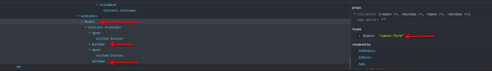

Our 2 `Windows` are actually rendered in the React Component Tree, but they are not rendering anything. So they only start rendering something when this `openName` state equals the name of the window.

### Declaring a click outside the Modal

**<span style='color: #a8c62c'> hooks/useOutsideClick.jsx**

```javascript
if (ref.current && !ref.current.contains(e.target)) {
    handler();
}
```

Our Modal would automatically close as soon as we click on the *Add new cabin*, because of the way events work in JavaScript.

we have to listen and so the way that we fix this is to **not** listen for these events on the bubbling phase, but on the capturing phase, so basically, as the event moves down the DOM tree and not up the DOM tree,

`document.addEventListener("click", handleClick, listenCapturing);`

### Confirming Cabin Deletions

**<span style='color: #a8c62c'> ui/ConfirmDelete.jsx**

```javascript
<Button
  variation='secondary'
  disabled={disabled}
  onClick={() => onCloseModal?.()}
>
  Cancel
</Button>
```

In `CreateCabinForm` component, we had to pass `onCloseModal` to the `onSuccess` event of `@tanstack/react-query` to make sure that the modal closes after inserting a new cabin.

after deletion the modal window closes itself, which makes sense because after we delete the cabin, the row does no longer exist. And so, therefore, the modal component inside the row also no longer exists.

## Implementing more features: authentication, dark mode

### Client-Side Filtering: Filtering Cabins

Now we will do this in practice by storing the value by which the table should be filtered in the URL again. Because this way the URL is gonna be easily shareable and bookmarkable. And since we can read that state from everywhere in the app, the filter component doesn't have to be close to the cabin table. So it can really be anywhere we want in the component tree.

### Client-side Sorting: Sorting Cabins

By default `sort()` method sorts in an ascending way by default, so we apply a modifier conditionally to change the sort order.

```javascript
const [field, direction] = sortBy.split('-');
const modifier = direction === 'asc' ? 1 : -1;

const sortedCabins = filteredCabins.sort(
    (a, b) => (a[field] - b[field]) * modifier
  );
```

### Building the Bookings Table

when fetching data from *supabase* with foreign key, you need to reference the foreign table and fields you need if you don't want to retrieve only the ids but some data themselves:

**<span style='color: #a8c62c'> services/apiBookings.js**

```javascript
export async function getBookings() {
  let query = supabase
    .from('bookings')
    .select('*, cabins(name), guests(fullName, email)');
// ...
}
```


### API-Side Filtering Bookings

**<span style='color: #a8c62c'> features/bookings/useBookings.jsx**

`queryKey: ['bookings', filter],` by passing a dynamic key of the `react-query` cached query, the data will re-fetched each time that key change, just like the dependency array of `useEffect()`. this `filter` is then passed to our function call of the API service `apiBookings`.

```javascript
const [searchParams] = useSearchParams();
  // FILTER
  const filterValue = searchParams.get('status');
  const filter =
    !filterValue || filterValue === 'all'
      ? null
      : { field: 'status', value: filterValue };
  // { field: "totalPrice", value: 5000, method: "gte" };

const {
    isLoading,
    data: bookings,
    error,
  } = useQuery({
    queryKey: ['bookings', filter],
    queryFn: () => getBookings({filter}),
  });
```

**<span style='color: #495fcb'> Note:** To pass more complex query filters, you would need to pass an array to loop and build a more complex query within the `apiBookings`.

### API-Side Pagination: Paginating Bookings

*Supabase* can provide you directly the count of data, within the `select` statement, when fetching data from a `get`request. This is more elegant than using `length` of an the data array.

**<span style='color: #a8c62c'> services/apiBookings.js**

```javascript
let query = supabase
  .from('bookings')
  .select(
    'id, created_at, startDate, endDate, numNights, numGuests, status, totalPrice, cabins(name), guests(fullName, email)',
    { count: 'exact' }
);

// ...
const { data, error, count } = await query;
return {data, count};
```

**<span style='color: #a8c62c'> features/bookings/useBookings.js**

you of course need then to destructure the data differently in your `hook`.

```javascript
 const {
    isLoading,
    data: { data: bookings, count } = {}, //IMPORTANT
    error,
  } = useQuery({
    queryKey: ['bookings', filter, sortBy],
    queryFn: () => getBookings({ filter, sortBy }),
  });

  return { isLoading, error, bookings, count };
```

**<span style='color: #495fcb'> Note:** `query = query.range(from, to);` Supabase is 0 based !

### Prefetching With React Query

Prefetching is all about fetching some data that we know might become necessary before we actually need that data to render it on the user interface. And in the context of pagination, usually that means that we fetch the next page before it is actually displayed.

The user will never see any loading spinner, meaning that this looks just as if the data would actually be paginated on the front end. While in reality we know that this data is indeed actually fetched from the server. But since it is prefetched we really do not notice it.

**<span style='color: #495fcb'> Note:** As an alternative to prefetching and having pagination in the first place, would be to use infinite queries for infinite scroll with `react-query`. So React Query also has that feature built in.

### Building the single Booking page

**<span style='color: #875c5c'>IMPORTANT:** remember the rule that we set for ourselves in the beginning, which is that **a page should not fetch data and also not have any other side effects**.

this is not a hard rule in React or in front end development, but it's a rule that I've seen many people use, and I also use it myself because this makes the `pages` folder a lot cleaner and then leaves much of the development work in the `features` folder.

we can just implement a page, close the folder, and completely forget about it because all the things that are related to bookings will live here in the `features` folder.

remember that by default, React Query will try to fetch data three times in case that it fails in the beginning, but sometimes that might not make so much sense.

**<span style='color: #a8c62c'> features/useBooking.js**

```javascript
useQuery({
    queryKey: ['booking'],
    queryFn: () => getBooking(bookingId),
    retry: false,
  });
```

### Checking in a Booking

**<span style='color: #a8c62c'> features/useCheckin.js**

The mutation function has an `onSuccess` callback that receives the data returned by the `updateBooking` function of `services/apiBooking`, we can use it then inside the `onSuccess` callback:

```javascript
const { mutate: checkin, isLoading: isCheckingIn } = useMutation({
    mutationFn: ({ bookingId }) =>
      updateBooking(bookingId, {
        status: "checked-in",
        isPaid: true,
      }),

    onSuccess: (data) => {
      toast.success(`Booking #${data.id} successfully checked in`);
      queryClient.invalidateQueries({ active: true });
      navigate("/");
    },

    onError: () => toast.error("There was an error while checking in"),
  });
```

**<span style='color: #495fcb'> Note:** as alternative to invalidate queries by passing the *query key*, we can invalidate all *active queries* of the page: `queryClient.invalidateQueries({ active: true });`

### Deleting a Booking

**<span style='color: #495fcb'> Note:** We can also add `onSuccess`, or `onError` handlers, not only into the on *mutation hook* but only right into the individual *mutate functions*. we do not need to specify these handlers for all of the mutations, but we can also do it for individual mutations.

This is very useful if we want to have a different behavior in each mutation as in `BookingRow,jsx` and `BookingDetail.jsx`.

in the deletion of `BookingRow,jsx`, we want nothing to happen once it was successful but in `BookingDetail.jsx` deletion, we want to move back, we can then use the `onSuccess` handler there, rather than in the generic `useDeleteBooking` which would apply to both cases.

**<span style='color: #495fcb'> Note:** You can either use `onSuccess` or `onSettled` which will run whether it is a success or not.

**<span style='color: #a8c62c'> features/bookings/BookingDetail.jsx**

```javascript
<ConfirmDelete
  resourceName={`booking ${bookingId}`}
  disabled={isDeleting}
  onConfirm={() =>
    deleteBooking(bookingId, { onSettled: () => navigate(-1) })
  }
/>
```

### Authentication: User Login with Supabase

**<span style='color: #495fcb'> Note:** Users are not stored in a table like *bookings, cabins*, but you need to go the `authentication` tab, where the user table is created by default.


Deactivate *confirm email* for dev purpose:

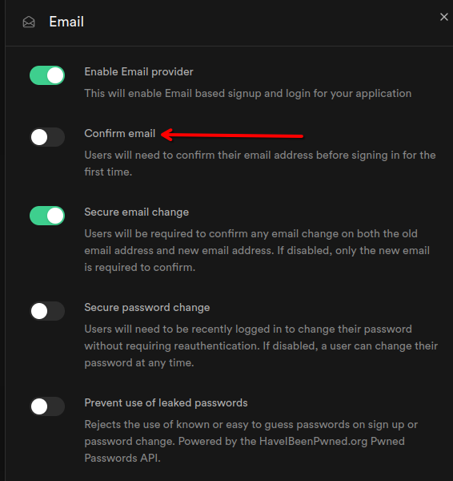

*Users* table / Add user: [ecr@test.com], [uolm4l3te@mozmail.com], [yovined130@oziere.com]  
password: test1234

#### API Docs / Authentication

Behind the scenes, Supabase authentication is using JWT technology.

#### API Docs / User Management

Code snippets for sign up / login / password forgotten / log out / get current logged in user

our `login` function within `services/apiAuth` will return a *session object* with an access and refresh tokens, that can be found in `Dev Tools / Storage / Local Storage`

- access token
- refresh token
- user Object

### Authorization: Protecting Routes

**<span style='color: #9e5231'>Error:** You can only call a hook such as `useNavigate` inside another function such as a `callback` or a `useEffect`, **but not at the top level of a component**:

**<span style='color: #a8c62c'> ui/ProtectedRoute.jsx**

```javascript
function ProtectedRoute({ children }) {
  const navigate = useNavigate();

  // 1. Load the authenticated user
  const { isLoading, isAuthenticated } = useUser();

  // 2. If there is NO authenticated user, redirect to the /login
  useEffect(
    function () {
      if (!isAuthenticated && !isLoading) navigate('/login');
    },
    [isAuthenticated, isLoading, navigate]
  );
//...
}
```

**<span style='color: #495fcb'> Note:** on `queryClient` on which we call `invalidateQueries, prefetchQuery`, we can also `setQueryData`, to manually set some data in the *react-query* cache. Remember that the first argument, the `queryKey` has to be an **array**!

In our case, once the `useLogin` was called and it reached the `onSuccess` block, it will navigate to *dashboard*. And so our `useUser` hook will be called as it's part of the protected routes; within `AppLayout`. this `useUser` hook uses the same key `user`, and if we set it manually `queryClient.setQueryData(['user'], user.user);`, *react-query* will simply get this data from the cache, instead of refetching the data, and the navigation to *dashboard* will work. Without this line, it won't be available in the *react-query* cache, and `isAuthenticated` will be false, and the redirection will then be to *login* page, while we are effectively logged in.

**<span style='color: #a8c62c'> features/authentication/useLogin.jsx**

```javascript
const { mutate: login, isLoading } = useMutation({
    mutationFn: ({ email, password }) => loginApi({ email, password }),
    onSuccess: (user) => {
      queryClient.setQueryData(['user'], user.user); //HACK: !!! allow redirection to dashboard right after login
      console.log(user);
      navigate('/dashboard', { replace: true });
    },
    onError: (err) => {
      console.log('ERROR', err);
      toast.error('Provided email or password are incorrect');
    },
// ...
});
```

So just logging out from *Supabase api* `await supabase.auth.signOut()` will remove the user from local storage and also from the server but it will stay inside the cache, that's why in our mutation we add: `queryClient.removeQueries();` (to remove all of them)

### Fixing an Important Bug

**<span style='color: #9e5231'>Error:** Initially the `useLogin` hook was using: `queryClient.setQueriesData(['user'], user);`

If un-logged we try to access the root which is unprotected: `http://localhost:5173` (no trailing /), it will store a null user, and this will then cause an issue when we then log in and in our `useUser` hook, where we run this test: `return { isLoading, user, isAuthenticated: user?.role === 'authenticated' };` as `user` will now be null, this will always return `false` and you won't be automatically navigated to *dashboard*.

What needs to be used is instead: `queryClient.setQueryData(['user'], user.user);`

### User Sign Up

in *Supabase / Authentication / Emails*, you have the templated emails sent when you activate the *confirm email*.

in *Supabase / Authentication / URL Configuration*,m we need to update our application URL, for having a redirect URL working

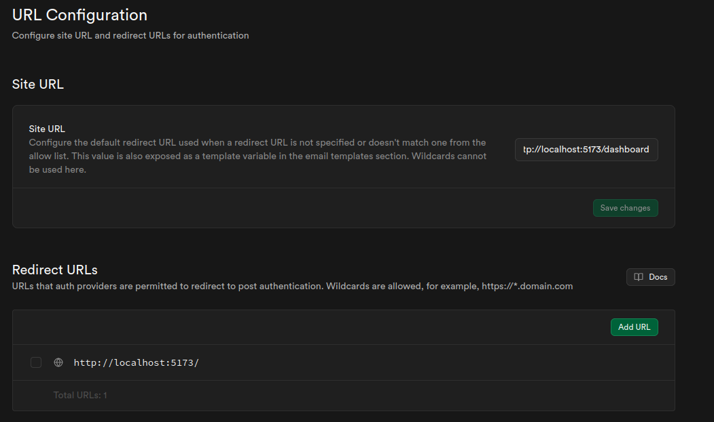

**<span style='color: #495fcb'> Note:** Just make sure to update these two URLs again once you deploy this application to a production server.

The new user will now be created but the log in would not work until the *supabase* confirmation link has not been confirmed, that will bring us to our dashboard with the new logged in user.

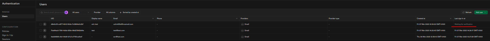

### Authorization on Supabase: Protecting Database (RLS)

Right now everyone could still fetch and mutate data from our API even if they cannot log into the applications UI that we have been building.  any malicious actor could very easily find out the URL to our API even if they cannot see this graphical user interface. So just from reading our front end code, they could figure that out and then they could, for example, delete all of our bookings, or all of our cabins, and really destroy our entire app.

**<span style='color: #a3842c'>Supabase Authenticated & unauthenticated roles:** [https://supabase.com/docs/guides/database/postgres/row-level-security#authenticated-and-unauthenticated-roles]

You can edit all *RLS* and change the `to` clause from `public` to `authenticated` under `Authentication / Policies / Edit Policy`.

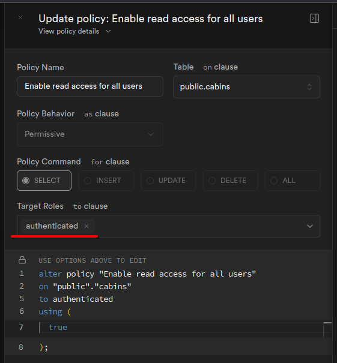

**<span style='color: #a8c62c'> pages/Login.jsx** When you are not authenticated, you can manipulate the DOM and add components to have malicious effect on the **database without RLS on the database.**

```javascript
function Login() {
  return (
    <LoginLayout>
      <Logo />
      <Heading as='h4'>Log in to your account</Heading>
      <LoginForm />

      <CabinTable /> //ERROR: this would still retrieve the cabins , and you could also delete, even when not being authenticated
    </LoginLayout>
  );
}
```

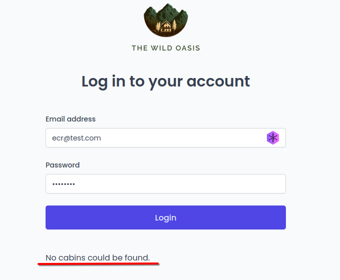

### Building The App Header

**<span style='color: #a3842c'>Supabase user-metadata:** [<https://supabase.com/docs/guides/auth/managing-user-data#adding-and-retrieving-user-metadata>]

`select email, raw_user_meta_data from auth.users`

for the new component `UserAvatar`, note that the user_metadata are created for users that were created subsequently when the `options` were created:

**<span style='color: #a8c62c'> services/apiAuth.js**

```javascript
const { data, error } = await supabase.auth.signUp({
    email,
    password,
    options: {
      data: {
        fullName,
        avatar: '',
      },
    },
  });
```

**<span style='color: #495fcb'> Note:** You can either use:

- [https://temp-mail.org/en/]
- Mozilla FireFox Relay extension

### Updating User Data and Password

`const { register, formState, getValues, handleSubmit, reset } = useForm();`, the `reset` function of *react-hook-form*  will reset both the input field and the error associated, if any.

### Implementing Dark Mode with CSS Variables

```css
:root {
  &.light-mode {
  }
}
```

`&.light-mode {...}` is equivalent to `:root.light-mode`

to implement a default case if no light-mode or dark-mode has been passed to the root element which is `<html ...>`: `&, &.light-mode {..}`

### Displaying a Line Chart with the Recharts Library

**<span style='color: #a3842c'>Recharts Library:** [https://recharts.org/en-US/]

`npm install recharts`

### Displaying Stays for current day

**<span style='color: #a8c62c'> features/check-in-out.jsx**

```javascript
<Button
  size='small'
  variation='primary'
  as={Link}
  to={`/checkin/${id}`}
>
  Check in
</Button>
```

**<span style='color: #495fcb'> Note:** *React* extends *html* `button` with an `as` prop, which allows to easily turn a button into an html `link`, or directly to a React `Link` (which is an `anchor` element), by overriding the underlying HTML tag of the `Button.jsx` component, and handle external links. We of course specify the link with the `to` props.

**<span style='color: #a3842c'>Link:** [https://whereisthemouse.com/how-to-use-button-as-link-in-react]

Shifting from grid template with 4 columns to 5 columns, and how to center *today's activity* and *stay duration* components (shifting to 10 columns grid)

- **<span style='color: #a3842c'>CSS nth child:** [https://developer.mozilla.org/en-US/docs/Web/CSS/:nth-child]
- **<span style='color: #a3842c'>Take half width in 3 columns CSS grid layout:** [https://stackoverflow.com/questions/63222551/take-half-width-in-3-columns-css-grid-layout]

### Error Boundaries

So all these times where we get a white screen in development when the app stops working, our users would also only get that white screen in production. And so that's just completely unacceptable, because then the user has no idea what to do.

So **error boundaries** are like try-catch but for React rendering, which basically allows us to react to JavaScript errors in our render code, so in React render logic.

**<span style='color: #a3842c'>react-error-boundary:** [https://www.npmjs.com/package/react-error-boundary]

**<span style='color: #875c5c'>IMPORTANT:** these error boundaries really only catch errors while React is rendering.

So bugs that occur in some event handlers, or in an effect or in some asynchronous code will not be caught by the error boundary. But for those, we many times have some other mechanisms, like for example, those errors that are usually returned from `useQuery()`.

### Fixing Bugs

if a user pass an unknow booking id, it would trigger an error boundary. To avoid this behavior, we update our `BookingDetail.jsx` with: `if (!booking) return <Empty resource='booking' />;`

if there is no `isDarkMode` key already set in our *localStorage*, by passing the below **media query** to our `useLocalStorage` as the initial state, the first time we access the app, it would be in dark mode then. After the *localStorage* value would be used.

```javascript
useLocalStorageState(
    window.matchMedia('(prefers-color-scheme: dark)').matches,
    'isDarkMode'
  );
```

### Additional features: create booking

**<span style='color: #a3842c'>react-hook-form setValue:** [https://react-hook-form.com/docs/useform/setvalue]

## Deployment with Netlify and Vercel

### Deploying to Netlify

`npm run build`

You can select in the main menu *Add new Site / Manually*:  [https://app.netlify.com/drop]

Site Settings / Change site name
<!---
[comment]: it works with text, you can rename it how you want


**<span style='color: #875c5c'>IMPORTANT:**
**<span style='color: #495fcb'> Note:**
**<span style='color: #a3842c'>Link:**
**<span style='color: #9e5231'>Error:**

**<span style='color: #a8c62c'> TabButton.jsx**

<ins>text to underline</ins>

--- : horizontal line

| Property    | Description | Default |
| -------- | ------- | ------- |
| view engine  | The default engine extension to use when omitted. NOTE: Sub-apps will inherit the value of this setting.    | |
| views |  A directory or an array of directories for the application's views. If an array, the views are looked up in the order they occur in the array. | `process.cwd() + '/views'` |

-->

<!-- markdownlint-enable MD033 -->
<!-- markdownlint-enable MD024 -->